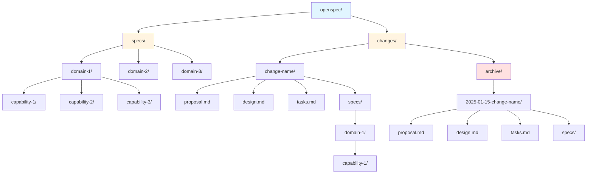
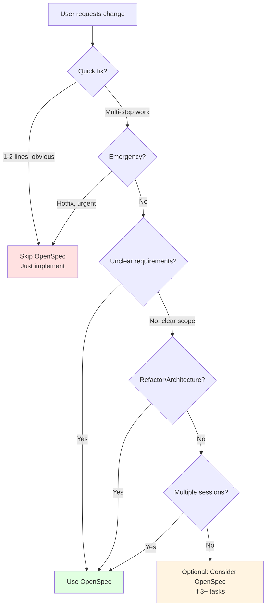

# OpenSpec for AI Agents

## What is OpenSpec?

Spec-driven development framework: agree on WHAT to build before writing code. Artifacts live in repository, not tool-specific systems.

## Why It Matters

You'll encounter OpenSpec artifacts in projects using this framework. Understanding them helps you align implementation with documented requirements.

## Artifact Types

| Artifact      | Purpose                  | Contains                            |
| ------------- | ------------------------ | ----------------------------------- |
| `proposal.md` | Why & what               | Intent, scope, capabilities, impact |
| `specs/`      | Requirements             | Testable GIVEN/WHEN/THEN scenarios  |
| `design.md`   | How to implement         | Context, decisions, tradeoffs       |
| `tasks.md`    | Implementation checklist | Progress-tracked checkboxes         |

## Directory Structure



## Delta Spec Format

```markdown
### Requirement: Session Expiration

The system SHALL expire sessions after 30 minutes.

#### Scenario: Idle Timeout

- GIVEN an authenticated session
- WHEN 30 minutes pass without activity
- THEN session is invalidated
```

Sections: **ADDED** (new), **MODIFIED** (changed), **REMOVED** (deleted)

## When to Read Artifacts

- Before implementing (align with specs/design)
- When uncertain about requirements
- To understand context for bug fixes

## When to Suggest Creating Artifacts



**Yes - Use OpenSpec when:**

- Multi-step implementation (3+ distinct tasks)
- Unclear requirements or multiple approaches exist
- Refactors or architectural changes
- Changes affecting multiple files/systems
- Work spanning multiple sessions

**No - Skip when:**

- Single obvious fixes (1-2 lines)
- Emergency hotfixes (document afterward)
- Pure debugging/investigation

## Key Points

- Specs are living documents, update as you learn
- Delta specs prevent duplication (only document what's changing)
- Archive preserves history with date prefix
- Main specs merge from delta on archive

See `references/artifact-formats.md` for detailed examples.
