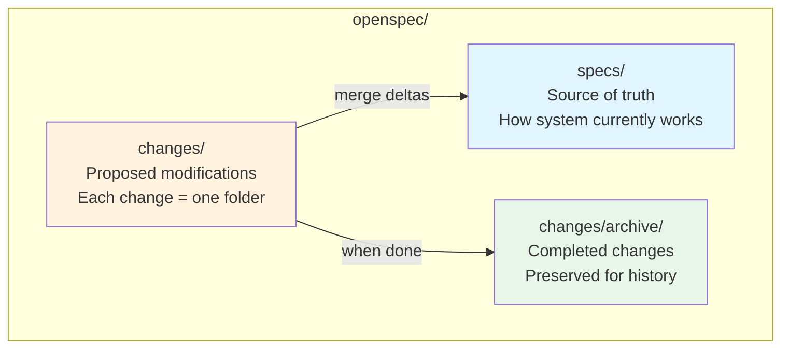
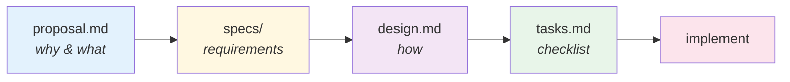
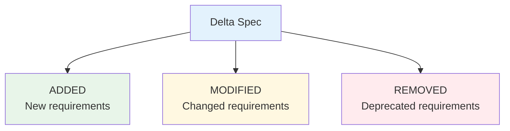
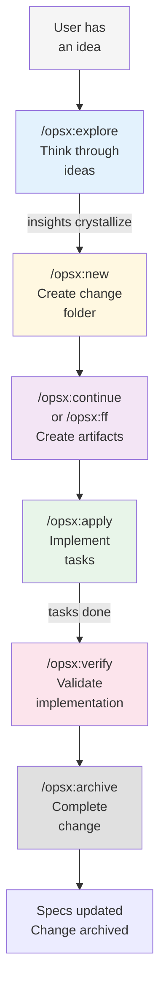
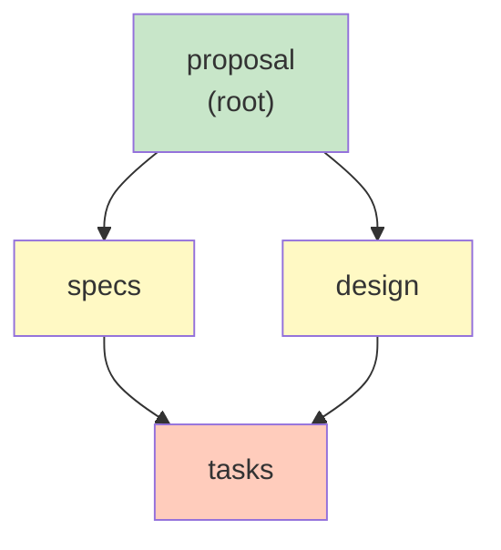
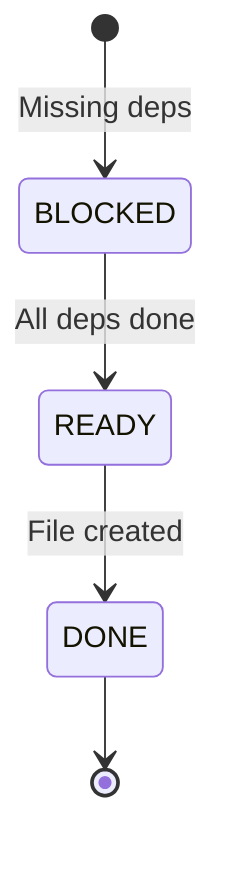
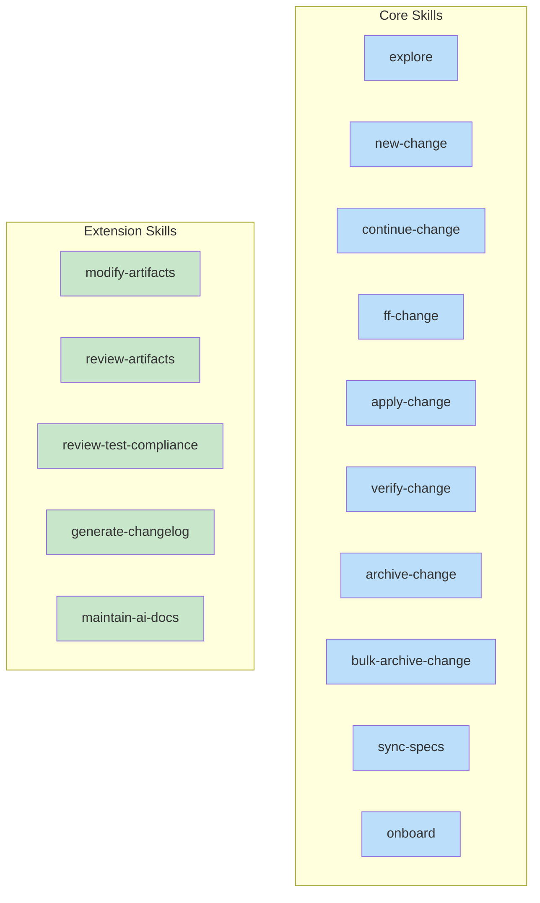
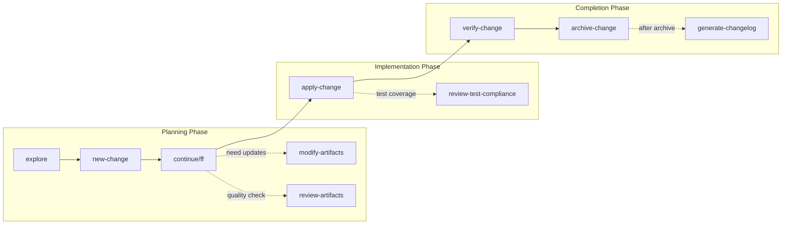
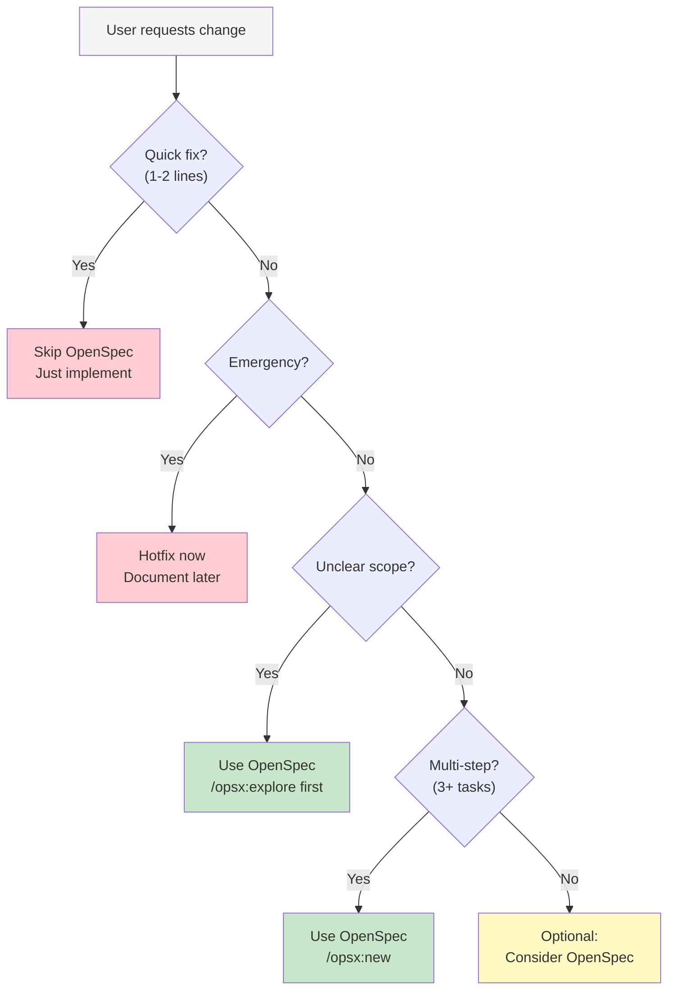
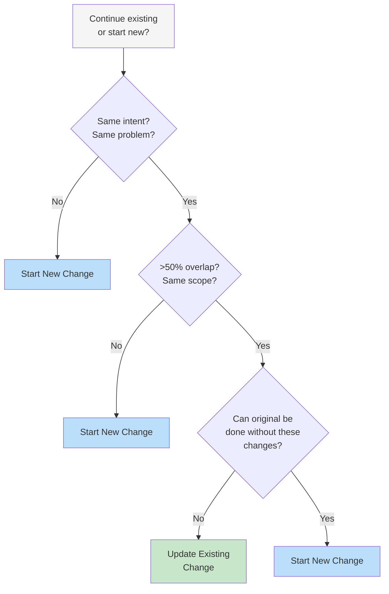

# OpenSpec for AI Agents

A comprehensive guide to the OpenSpec framework: spec-driven development where you agree on WHAT to build before writing code. All artifacts live in the repository, enabling collaboration between humans and AI.

---

## 1. Philosophy

### Core Principles

OpenSpec is built on four principles that guide all design decisions:

| Principle | Meaning | Why It Matters |
|-----------|---------|----------------|
| **Fluid not rigid** | No phase gates, work on what makes sense | Work doesn't fit linear phases |
| **Iterative not waterfall** | Learn as you build, refine as you go | Requirements change, understanding deepens |
| **Easy not complex** | Lightweight setup, minimal ceremony | Get started in seconds |
| **Brownfield-first** | Works with existing codebases | Most work modifies existing systems |

### The Big Picture

OpenSpec organizes work into two main areas:



**Key insight**: Specs describe current behavior. Changes propose modifications (as deltas). Archive merges deltas into specs, updating the source of truth.

---

## 2. Artifacts System

### The Artifact Flow

Artifacts build on each other in a dependency chain:



### Artifact Types

| Artifact | Purpose | Contains | When Used |
|----------|---------|----------|-----------|
| `proposal.md` | Why & what | Intent, scope, approach, impact | Every change starts here |
| `specs/` | Requirements | GIVEN/WHEN/THEN scenarios | Describes what's changing |
| `design.md` | How | Context, decisions, tradeoffs | Technical approach |
| `tasks.md` | Checklist | Progress-tracked `[ ]` / `[x]` | Implementation steps |

### Delta Specs Format

Delta specs describe **what's changing** relative to current specs:



**Delta sections on archive**:

| Section | What Happens |
|---------|--------------|
| `## ADDED Requirements` | Appended to main spec |
| `## MODIFIED Requirements` | Replaces existing requirement |
| `## REMOVED Requirements` | Deleted from main spec |

**Example delta spec**:

```markdown
## ADDED Requirements

### Requirement: Theme Selection

The system SHALL allow users to choose between light and dark themes.

#### Scenario: Manual toggle

- GIVEN a user on any page
- WHEN user clicks theme toggle
- THEN theme switches immediately
- AND preference persists across sessions

## MODIFIED Requirements

### Requirement: Session Expiration

The system MUST expire sessions after 15 minutes of inactivity.
(Previously: 30 minutes)

## REMOVED Requirements

### Requirement: Remember Me
(Deprecated in favor of 2FA)
```

### Directory Structure

```
openspec/
├── specs/                    # Source of truth (current behavior)
│   ├── auth/
│   │   └── spec.md
│   └── payments/
│       └── spec.md
│
├── changes/                  # Active changes
│   ├── add-dark-mode/        # One folder per change
│   │   ├── proposal.md
│   │   ├── design.md
│   │   ├── tasks.md
│   │   └── specs/            # Delta specs
│   │       └── ui/spec.md
│   │
│   └── archive/              # Completed changes
│       └── 2025-01-15-add-dark-mode/
│
└── config.yaml               # Project configuration (optional)
```

### Project Configuration

The optional `openspec/config.yaml` provides project-specific context that enhances artifact generation via the `openspec instructions` CLI command:

| Field | Purpose | Example |
|-------|---------|---------|
| `schema` | Default workflow schema | `spec-driven` |
| `context` | Injected into all artifact instructions | Tech stack, conventions |
| `rules` | Per-artifact rules | `proposal: include rollback plan` |

**Example config.yaml**:

```yaml
schema: spec-driven

context: |
  Tech stack: TypeScript, React, Node.js
  API conventions: RESTful, JSON responses
  Testing: Vitest for unit tests, Playwright for e2e

rules:
  proposal:
    - Include rollback plan
    - Identify affected teams
  specs:
    - Use Given/When/Then format for scenarios
  design:
    - Include sequence diagrams for complex flows
```

**How it works**:
- `context` is wrapped in `<context>` tags and prepended to all artifact instructions
- `rules` are wrapped in `<rules>` tags and injected only for matching artifacts
- When using `openspec instructions --json`, this context appears automatically

---

## 3. OPSX Workflow Lifecycle

### Complete Lifecycle



### Actions, Not Phases

Commands are things you can do anytime, not stages you're stuck in. Dependencies are **enablers**, not gates—they show what's possible, not what you must do next.

You can:
- Start with `/opsx:new`, then `/opsx:continue` to create artifacts one at a time
- Or use `/opsx:ff` to create all artifacts at once
- During `/opsx:apply`, edit artifacts as you learn (design was wrong? fix it and continue)
- Run `/opsx:verify` before archiving, or skip it entirely

### Dependency Graph & State Transitions

Artifacts form a directed acyclic graph (DAG):



**State transitions**:



| State | Meaning |
|-------|---------|
| `BLOCKED` | Missing dependencies |
| `READY` | All dependencies exist, can create |
| `DONE` | File exists on filesystem |

---

## 4. AI Slash Commands

### Quick Reference

| Command | Purpose | When to Use |
|---------|---------|-------------|
| `/opsx-explore` | Think through ideas | Unclear requirements, investigation |
| `/opsx-new` | Start a change | Beginning any new work |
| `/opsx-continue` | Create next artifact | Step-by-step, want control |
| `/opsx-ff` | Create all artifacts at once | Clear scope, ready to build |
| `/opsx-apply` | Implement tasks | Ready to write code |
| `/opsx-verify` | Validate implementation | Before archiving |
| `/opsx-sync` | Merge delta specs | Optional—archive prompts if needed |
| `/opsx-archive` | Complete the change | All work finished |
| `/opsx-bulk-archive` | Archive multiple changes | Parallel work completed |

**Note**: Each `/opsx-` command invokes a corresponding skill (e.g., `/opsx-explore` invokes `openspec-explore`).

### When to Use: Continue vs Fast-Forward

| Situation | Use |
|-----------|-----|
| Clear requirements, ready to build | `/opsx:ff` |
| Exploring, want to review each step | `/opsx:continue` |
| Complex change, want control | `/opsx:continue` |
| Time pressure, need to move fast | `/opsx:ff` |

**Rule of thumb**: If you can describe the full scope upfront, use `/opsx:ff`. If you're figuring it out as you go, use `/opsx:continue`.

### CLI Commands

For detailed CLI reference, see `references/cli-reference.md`. Key commands for AI agents:

| CLI Command | Purpose |
|-------------|---------|
| `openspec status --change <name> --json` | Check artifact completion state |
| `openspec instructions <artifact> --change <name> --json` | Get enriched creation instructions |
| `openspec list --json` | List active changes |
| `openspec validate --all --json` | Validate all changes/specs |

---

## 5. OpenSpec Ecosystem

### Core Skills vs Extension Skills

OpenSpec skills fall into two categories:

| Category | Purpose | Examples |
|----------|---------|----------|
| **Core Skills** | Standard OPSX workflow | explore, new, apply, archive |
| **Extension Skills** | Enhanced utilities | modify-artifacts, review-test-compliance, generate-changelog |



### How Skills Integrate into Lifecycle



### Core Skills

Implement the standard OPSX workflow.

| Skill | Phase | Description |
|-------|-------|-------------|
| `openspec-onboard` | Learning | Guided tutorial for first-time users |
| `openspec-explore` | Planning | Think through problems without committing |
| `openspec-new-change` | Planning | Start a new change folder |
| `openspec-continue-change` | Planning | Create one artifact at a time |
| `openspec-ff-change` | Planning | Fast-forward through all artifacts |
| `openspec-apply-change` | Implementation | Work through tasks |
| `openspec-verify-change` | Completion | Validate implementation |
| `openspec-archive-change` | Completion | Finalize and archive |
| `openspec-bulk-archive-change` | Completion | Archive multiple changes |
| `openspec-sync-specs` | Completion | Merge deltas to main specs |

### Extension Skills

Enhanced utilities for quality and maintenance.

| Skill | When to Invoke | Purpose |
|-------|----------------|---------|
| `openspec-modify-artifact` | During planning/apply | Modify existing artifacts with dependency tracking |
| `openspec-review-artifact` | After creating artifacts | Review for quality, completeness, consistency |
| `openspec-review-test-compliance` | During/after apply | Ensure spec requirements have tests |
| `openspec-generate-changelog` | After archive | Generate changelog from archived changes |
| `openspec-maintain-ai-docs` | Ongoing | Keep AGENTS.md/CLAUDE.md synchronized |

---

## 6. Decision Guidance

### When to Use OpenSpec



**Use OpenSpec when**:
- Multi-step implementation (3+ distinct tasks)
- Unclear requirements or multiple approaches exist
- Refactors or architectural changes
- Changes affecting multiple files/systems
- Work spanning multiple sessions

**Skip OpenSpec when**:
- Single obvious fixes (1-2 lines)
- Emergency hotfixes (document afterward)
- Pure debugging/investigation

### Update vs. New Change



| Test | Update | New Change |
|------|--------|------------|
| **Identity** | "Same thing, refined" | "Different work" |
| **Scope overlap** | >50% overlaps | <50% overlaps |
| **Completion** | Can't finish original without these changes | Original is done, new work stands alone |

### Naming Conventions

```
Good:                          Avoid:
add-dark-mode                  feature-1
fix-login-redirect             update
optimize-product-query         changes
implement-2fa                  wip
refactor-auth-module           temp
```

**Pattern**: `<verb>-<noun>-<detail>` where verb is the action, noun is the target.

---

## 7. Quick Reference

### Glossary

| Term | Definition |
|------|------------|
| **Artifact** | A document within a change (proposal, design, tasks, or delta specs) |
| **Archive** | Process of completing a change and merging its deltas into main specs |
| **Change** | A proposed modification, packaged as a folder with artifacts |
| **Delta spec** | A spec describing changes (ADDED/MODIFIED/REMOVED) relative to current specs |
| **Domain** | A logical grouping for specs (e.g., `auth/`, `payments/`) |
| **Requirement** | A specific behavior the system must have (SHALL/MUST/SHOULD) |
| **Scenario** | A concrete example in Given/When/Then format |
| **Schema** | Definition of artifact types and their dependencies |
| **Spec** | Specification containing requirements and scenarios |
| **Source of truth** | The `openspec/specs/` directory with current behavior |

### RFC 2119 Keywords

| Keyword | Meaning |
|---------|---------|
| **MUST / SHALL** | Absolute requirement |
| **SHOULD** | Recommended, but exceptions exist |
| **MAY** | Optional |

### Related Documentation

- `references/artifact-formats.md` - Detailed artifact structure and examples
- `references/change-guidance.md` - When to update vs. start fresh
- `references/opsx-lifecycle.md` - Detailed workflow with state diagrams
- `references/cli-reference.md` - CLI commands for AI agents
- `research/openspec-concepts.md` - Full upstream concepts documentation
- `research/openspec-workflows.md` - Workflow patterns

**Note**: These reference files are provided by OpenSpec CLI in projects using the framework.

---

## Input

No arguments required. Invoke this skill to learn about the OpenSpec framework.

---

## Steps

This skill is organized into sections for self-guided learning:

1. **Section 1: Philosophy** - Covers why OpenSpec works this way

2. **Section 2: Artifacts** - Explains the artifact system and delta specs

3. **Section 3: Workflow** - Details the complete OPSX lifecycle

4. **Section 4: Commands** - Provides slash commands and CLI usage reference

5. **Section 5: Ecosystem** - Distinguishes core vs extended skills

6. **Section 6: Guidance** - Offers decision-making frameworks

7. **Section 7: Reference** - Provides quick lookup tables

---

## Output

After running this skill, the AI agent understands:

- OpenSpec philosophy and why it matters
- All artifact types and their relationships
- The complete OPSX lifecycle from explore to archive
- Available slash commands and when to use each
- The difference between core and extended skills
- How to decide when to use OpenSpec vs. skip
- When to update an existing change vs. start new

---

## Guardrails

- **DO**: Provide clear examples and diagrams for each concept
- **DO**: Reference detailed documentation in `references/` and `research/`
- **DO**: Explain both core and extended skills
- **DON'T**: Modify any files (this is informational only)
- **DON'T**: Reference non-existent files or documentation
- **DON'T**: Duplicate content verbatim from research/ - synthesize and summarize
