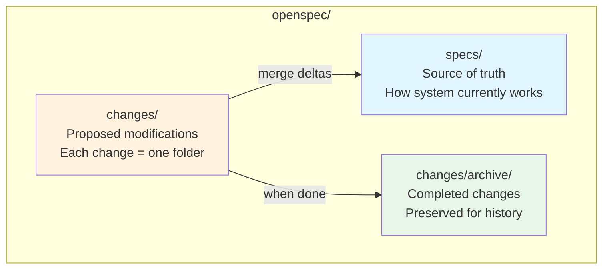
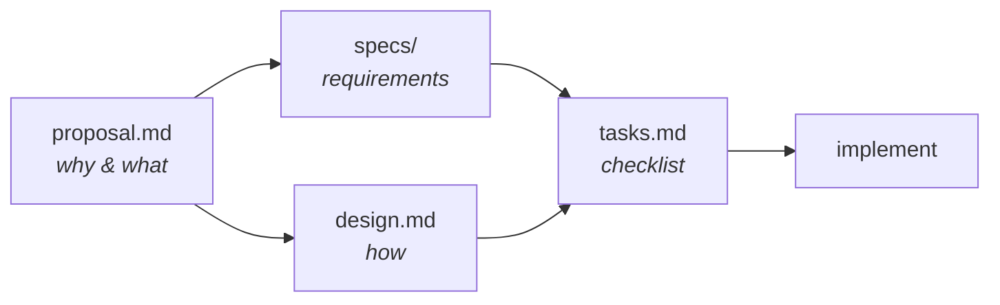
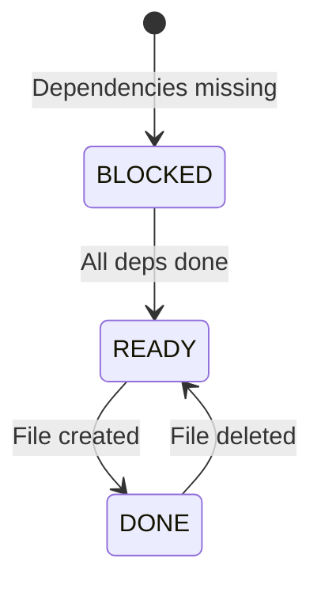
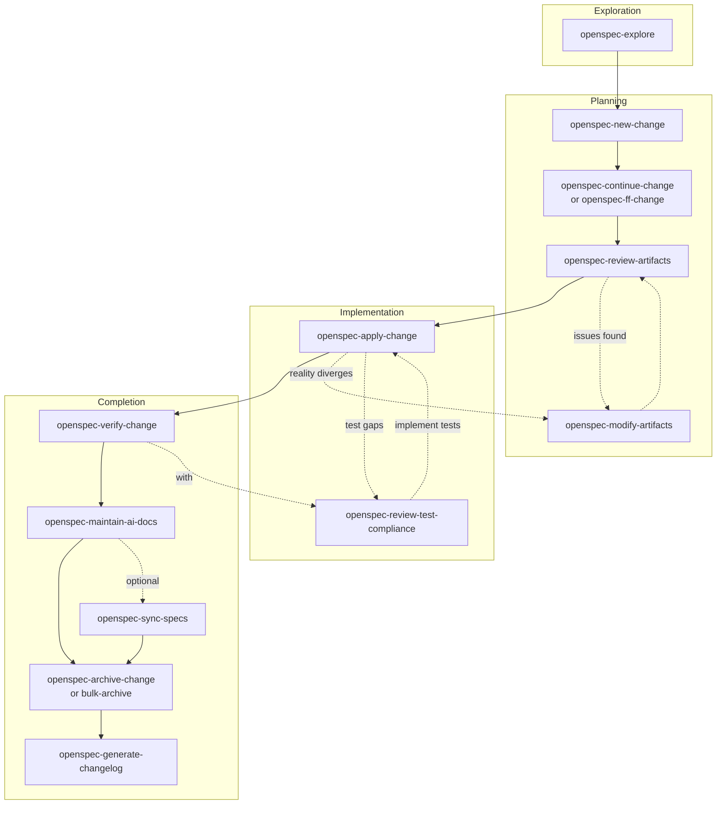
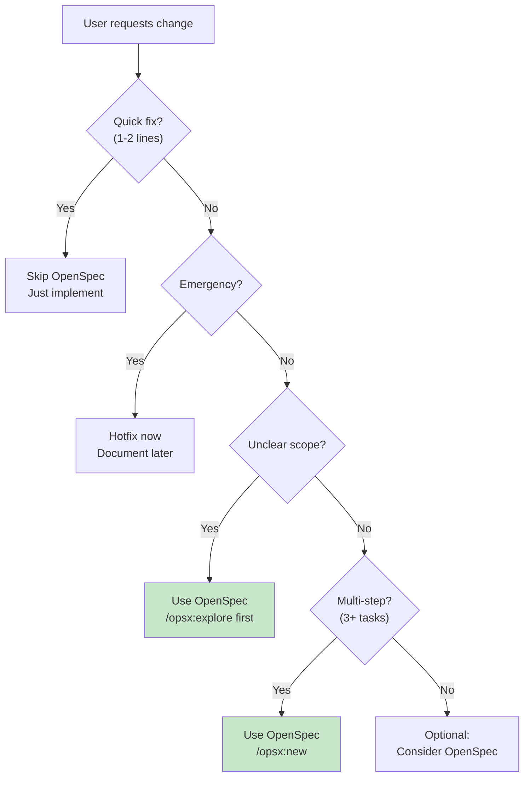
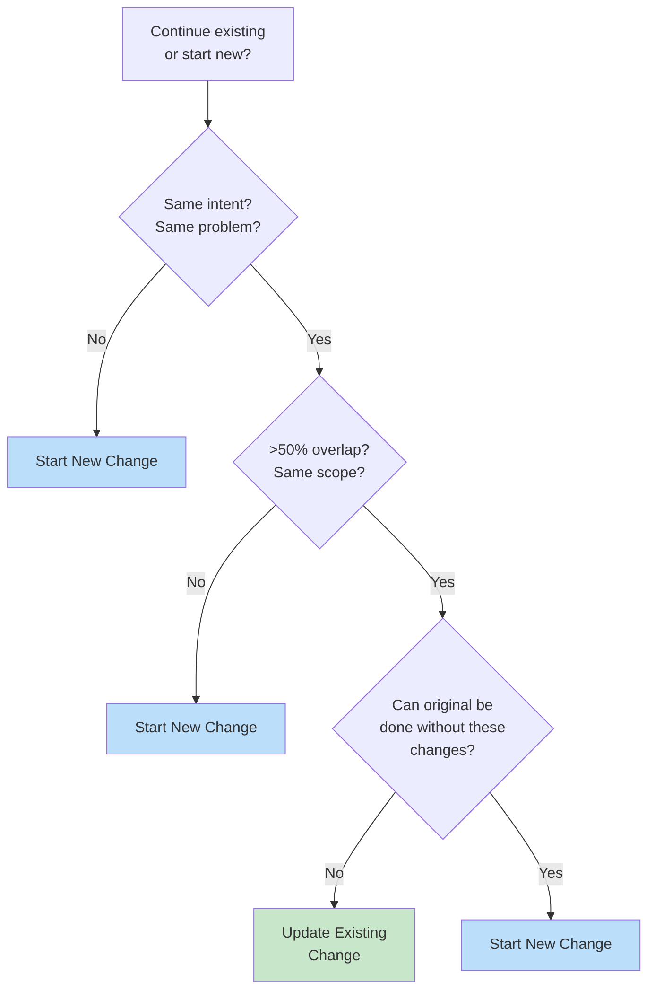

# OpenSpec for AI Agents

Comprehensive guide to the OpenSpec-extended framework: spec-driven development where you agree on WHAT to build before writing code. All artifacts live in the repository, enabling collaboration between humans and AI.

---

## TL;DR: The Mental Model (30 Seconds)

**Core Insight**: Work isn't linear. OpenSpec embraces this with fluid actions, not rigid phases.

**What OpenSpec Is**: A framework for spec-driven development where you:
1. Define WHAT to build (specs) before writing code
2. Track changes as self-contained folders with artifacts
3. Merge completed changes into the source of truth

**5 Essential Commands**:
| Command | Does |
|---------|------|
| `/opsx:explore` | Think through ideas |
| `/opsx:new` | Start a change |
| `/opsx:ff` | Create all artifacts |
| `/opsx:apply` | Implement tasks |
| `/opsx:archive` | Complete change |

**Artifact Flow**:
```
proposal ──→ specs ──→ design ──→ tasks ──→ implement
  (why)      (what)     (how)     (steps)
```

**Skip OpenSpec When**: 1-2 line fixes, emergency hotfixes, pure debugging.

**Full details below. Reference files for deep dives.**

---

## 1. Philosophy: Think in OpenSpec

### The Problem OpenSpec Solves

Traditional workflows pretend work is linear: plan → implement → done. But real work doesn't work that way. You implement something, realize your design was wrong, need to update specs, continue implementing. Linear phases fight against how work actually happens.

### OpenSpec's Answer

**Fluid actions, not rigid phases.**

Commands are things you can do anytime. Dependencies are enablers—they show what's possible, not what you must do next. You can:
- Start with `/opsx:new`, then `/opsx:continue` to create artifacts one at a time
- Or use `/opsx:ff` to create all artifacts at once
- During `/opsx:apply`, edit artifacts as you learn (design was wrong? fix it and continue)
- Run `/opsx:verify` before archiving, or skip it entirely

### Four Principles

| Principle | Meaning | In Practice |
|-----------|---------|-------------|
| **Fluid not rigid** | No phase gates | Work doesn't fit linear phases |
| **Iterative not waterfall** | Learn as you build | Requirements change, understanding deepens |
| **Easy not complex** | Minimal ceremony | Get started in seconds |
| **Brownfield-first** | Works with existing code | Most work modifies existing systems |

---

## 2. Core Concepts

### 2.1 The Big Picture



**Specs** = source of truth (current behavior). **Changes** = proposed modifications. **Archive** = completed history.

### 2.2 Artifacts

Artifacts are documents within a change that guide the work:



| Artifact | Purpose | Contains |
|----------|---------|----------|
| `proposal.md` | Why & what | Intent, scope, approach, impact |
| `specs/` | Requirements | GIVEN/WHEN/THEN scenarios as deltas |
| `design.md` | How | Context, decisions, tradeoffs |
| `tasks.md` | Checklist | Progress-tracked `[ ]` / `[x]` items |

**For detailed artifact structure and examples**, see `references/artifact-formats.md`.

### 2.3 Delta Specs

Delta specs describe **what's changing** relative to current specs:

| Section | What Happens on Archive |
|---------|------------------------|
| `## ADDED Requirements` | Appended to main spec |
| `## MODIFIED Requirements` | Replaces existing requirement |
| `## REMOVED Requirements` | Deleted from main spec |

**Example**:
```markdown
## ADDED Requirements

### Requirement: Theme Selection
The system SHALL allow users to choose between light and dark themes.

#### Scenario: Manual toggle
- GIVEN a user on any page
- WHEN user clicks theme toggle
- THEN theme switches immediately
- AND preference persists across sessions

## MODIFIED Requirements

### Requirement: Session Expiration
The system MUST expire sessions after 15 minutes of inactivity.
(Previously: 30 minutes)
```

### 2.4 Artifact State Machine

Every artifact exists in one of three states:



| State | Symbol | Meaning | Example |
|-------|--------|---------|---------|
| `BLOCKED` | ○ | Dependencies not met | `tasks` waiting for `specs` and `design` |
| `READY` | ◆ | Can create now | `specs` ready after `proposal` exists |
| `DONE` | ✓ | File exists | `proposal.md` created |

**Query state anytime**:
```bash
openspec status --change "<name>" --json
```

Returns JSON with artifact states. See `references/cli-reference.md` for full JSON schema.

---

## 3. Lifecycle Overview

### Extended Workflow Phases



### Skills by Phase (OpenSpec-Extended)

| Phase | Skill | Purpose |
|-------|-------|---------|
| **Exploration** | `openspec-explore` | Think through ideas without committing |
| **Planning** | `openspec-new-change` | Create change folder |
| | `openspec-continue-change` | Create one artifact at a time |
| | `openspec-ff-change` | Create all artifacts at once |
| | `openspec-review-artifacts` | Review for quality/completeness |
| | `openspec-modify-artifacts` | Update artifacts with tracking |
| **Implementation** | `openspec-apply-change` | Implement tasks from tasks.md |
| | `openspec-review-test-compliance` | Check spec→test alignment |
| **Completion** | `openspec-verify-change` | Validate implementation |
| | `openspec-maintain-ai-docs` | Update AGENTS.md |
| | `openspec-sync-specs` | Merge delta specs (usually auto) |
| | `openspec-archive-change` | Finalize single change |
| | `openspec-bulk-archive-change` | Archive multiple changes |
| | `openspec-generate-changelog` | Generate CHANGELOG.md |

**Core vs Extension**:
- **Core skills** (10): Standard OPSX workflow (explore, new, continue, ff, apply, verify, archive, etc.)
- **Extension skills** (5): Enhanced utilities (modify-artifacts, review-artifacts, review-test-compliance, generate-changelog, maintain-ai-docs)

---

## 4. Operational Guidance

### 4.1 Decision: When to Use OpenSpec



**Use OpenSpec when**: Multi-step (3+ tasks), refactors, architectural changes, unclear requirements, work spanning multiple sessions.

**Skip OpenSpec when**: Single obvious fixes (1-2 lines), emergency hotfixes, pure debugging/investigation.

### 4.2 Decision: Update vs New Change



| Test | Update | New Change |
|------|--------|------------|
| **Identity** | "Same thing, refined" | "Different work" |
| **Scope overlap** | >50% overlaps | <50% overlaps |
| **Completion** | Can't finish original without changes | Original done, new work stands alone |

### 4.3 Decision: Continue vs Fast-Forward

| Situation | Use |
|-----------|-----|
| Clear requirements, ready to build | `/opsx:ff` |
| Exploring, want to review each step | `/opsx:continue` |
| Complex change, want control | `/opsx:continue` |
| Time pressure, need to move fast | `/opsx:ff` |

**Rule of thumb**: If you can describe the full scope upfront, use `/opsx:ff`. If you're figuring it out as you go, use `/opsx:continue`.

### 4.4 Common Patterns

**Quick Feature Pattern**:
```
/opsx:new → /opsx:ff → /opsx:apply → /opsx:verify → /opsx:archive
```

**Exploratory Pattern**:
```
/opsx:explore → [investigation] → /opsx:new → /opsx:continue → ... → /opsx:apply
```

**Parallel Changes Pattern**:
```
Change A: /opsx:new → /opsx:ff → /opsx:apply (pause)
                                    │
                              context switch
                                    │
Change B: /opsx:new → /opsx:ff → /opsx:apply → /opsx:archive
                                    │
                              resume A
                                    │
Change A: /opsx:apply (resume) → /opsx:archive
```

---

## 5. AI Behavior Guide

### 5.1 How to Approach OpenSpec Work

1. **Always check state first** - Run `openspec status --json` before acting
2. **Don't guess change names** - Use `openspec list --json` and AskUserQuestion tool
3. **Update artifacts as you learn** - If implementation reveals design issues, pause and update
4. **Read context before creating** - Use `openspec instructions --json` for dependencies
5. **Mark tasks complete immediately** - Update checkboxes right after finishing each task

### 5.2 Essential CLI Commands

| Command | When to Use | Key Output Fields |
|---------|-------------|-------------------|
| `openspec status --change <name> --json` | Before creating artifacts | `artifacts[]`, `next`, `isComplete` |
| `openspec instructions <artifact> --change <name> --json` | Before creating artifact | `template`, `dependencies`, `rules` |
| `openspec list --json` | When change name not specified | `changes[]` |
| `openspec validate <name> --json` | Before archiving | `valid`, `errors[]`, `warnings[]` |

**Full CLI reference with JSON schemas**: `references/cli-reference.md`

### 5.3 Handling Ambiguity

| Situation | Action |
|-----------|--------|
| Multiple active changes | Use AskUserQuestion tool to select |
| Artifact creation unclear | Read `dependencies` from instructions output |
| Implementation diverges from design | Pause, update design.md, continue |
| Tasks seem wrong | Update tasks.md to match reality, continue |
| User changes scope | Update proposal.md, ripple to affected artifacts |

### 5.4 Anti-Patterns Quick Reference

| # | Mistake | Quick Fix |
|---|---------|-----------|
| 1 | Creating artifacts out of order | Check `status --json` first |
| 2 | Guessing change name | Use `list --json` + AskUserQuestion |
| 3 | Never updating artifacts | Edit freely during apply phase |
| 4 | Vague requirements | Add measurable criteria + scenarios |
| 5 | Copying context/rules into artifacts | They're guidance for YOU, not content |
| 6 | Skipping spec updates | Always sync before/during archive |

**Comprehensive anti-patterns (16 total)**: `references/anti-patterns.md`

---

## 6. Quick Reference

### 6.1 Slash Commands

| Command | Purpose | When to Use |
|---------|---------|-------------|
| `/opsx:explore` | Think through ideas | Unclear requirements, investigation |
| `/opsx:new` | Start a change | Beginning any new work |
| `/opsx:continue` | Create next artifact | Step-by-step, want control |
| `/opsx:ff` | Create all artifacts at once | Clear scope, ready to build |
| `/opsx:apply` | Implement tasks | Ready to write code |
| `/opsx:verify` | Validate implementation | Before archiving (optional) |
| `/opsx:sync` | Merge delta specs | Optional—archive prompts if needed |
| `/opsx:archive` | Complete the change | All work finished |
| `/opsx:bulk-archive` | Archive multiple changes | Parallel work completed |

### 6.2 Directory Structure

```
openspec/
├── specs/                    # Source of truth (current behavior)
│   ├── auth/
│   │   └── spec.md
│   └── payments/
│       └── spec.md
│
├── changes/                  # Active changes
│   ├── add-dark-mode/        # One folder per change
│   │   ├── proposal.md
│   │   ├── design.md
│   │   ├── tasks.md
│   │   └── specs/            # Delta specs
│   │
│   └── archive/              # Completed changes
│       └── 2025-01-15-add-dark-mode/
│
└── config.yaml               # Project configuration (optional)
```

### 6.3 Project Configuration

The optional `openspec/config.yaml` provides project-specific context:

```yaml
schema: spec-driven

context: |
  Tech stack: TypeScript, React, Node.js
  API conventions: RESTful, JSON responses
  Testing: Vitest for unit tests, Playwright for e2e

rules:
  proposal:
    - Include rollback plan
  design:
    - Include sequence diagrams for complex flows
```

**How it works**: Context/rules are injected into `openspec instructions` output automatically.

### 6.4 Glossary

| Term | Definition |
|------|------------|
| **Artifact** | A document within a change (proposal, design, tasks, or delta specs) |
| **Archive** | Process of completing a change and merging its deltas into main specs |
| **Change** | A proposed modification, packaged as a folder with artifacts |
| **Delta spec** | A spec describing changes (ADDED/MODIFIED/REMOVED) relative to current specs |
| **Domain** | A logical grouping for specs (e.g., `auth/`, `payments/`) |
| **Requirement** | A specific behavior the system must have (SHALL/MUST/SHOULD) |
| **Scenario** | A concrete example in Given/When/Then format |
| **Schema** | Definition of artifact types and their dependencies |
| **Spec** | Specification containing requirements and scenarios |
| **Source of truth** | The `openspec/specs/` directory with current behavior |

### 6.5 RFC 2119 Keywords

| Keyword | Meaning |
|---------|---------|
| **MUST / SHALL** | Absolute requirement |
| **SHOULD** | Recommended, but exceptions exist |
| **MAY** | Optional |

---

## Related Documentation

- `references/artifact-formats.md` - Detailed artifact structure and examples
- `references/cli-reference.md` - Complete CLI with JSON output schemas
- `references/anti-patterns.md` - Comprehensive common mistakes and recovery
- `references/opsx-lifecycle.md` - Detailed workflow and state transitions
- `references/change-guidance.md` - When to update vs. start fresh
