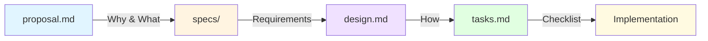
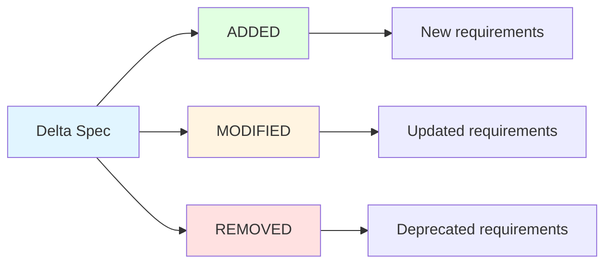
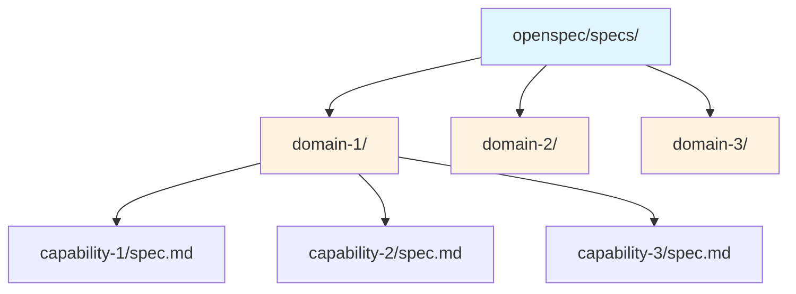
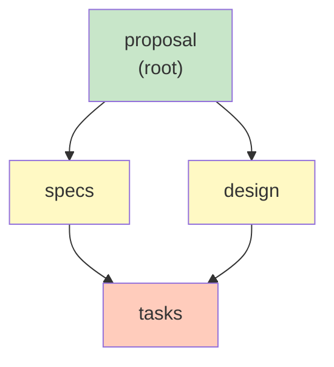
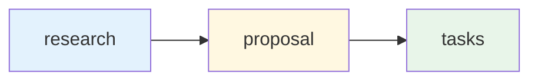

# Artifact Formats

Detailed structure and examples for OpenSpec artifacts.

## Artifact Types



### 1. Proposal (proposal.md)

**Purpose:** The "why" and "what" of a change

**When used:** Every change starts with a proposal

**Contains:**

- **Intent** - Why are we doing this? What problem/opportunity are we addressing?
- **Scope** - What's in scope, what's out? What files affected?
- **Capabilities** - New capabilities being added, or existing capabilities being modified
- **Impact** - What systems, users, or workflows are affected?

**Example intent:**

- "Users need dark mode for nighttime usage"
- "Session timeout is too short for security requirements"
- "Payment retry logic fails on network errors"

### 2. Specs (specs/)

**Purpose:** The "what" - requirements and testable scenarios

**When used:** Every change includes delta specs for what's changing

**Format:** GIVEN/WHEN/THEN scenarios that are directly testable

**Sections:**



- **ADDED** - New requirements being introduced
- **MODIFIED** - Changes to existing requirements
- **REMOVED** - Deprecating or removing requirements
- **RENAMED** - Refactoring requirement naming

**Example scenario:**

```markdown
### Requirement: Theme Selection

The system SHALL allow users to choose between light and dark themes.

#### Scenario: Manual toggle

- GIVEN a user on any page
- WHEN user clicks theme toggle
- THEN theme switches immediately
- AND preference persists across sessions
```

**Key benefit:** Scenarios can be literally read as test cases

### 3. Design (design.md)

**Purpose:** The "how" - technical approach and architectural decisions

**When used:** Every change includes design for implementation approach

**Contains:**

- **Context** - Current state, constraints, assumptions
- **Goals** - What we're trying to achieve
- **Non-goals** - What's explicitly out of scope
- **Decisions** - Technical choices with rationale
- **Tradeoffs** - Acknowledged compromises and why they're acceptable

**Example decision:**

```markdown
### Decision 1: Theme Implementation Approach

**Context:** We need to support light/dark themes across a large codebase with many components.

**Decision:** Use CSS custom properties (CSS variables) defined at root level, not per-component classes.

**Rationale:**

- Single source of truth for colors
- Easier to maintain and update
- Works with existing component library
- No build step required

**Tradeoffs:**

- Less granular control than per-component classes
- Requires refactoring existing components to use CSS variables

**Non-goals:**

- Supporting custom themes per user (out of scope for initial release)
- Theme marketplace or third-party themes (future consideration)
```

**Key benefit:** Future readers understand WHY technical choices were made

### 4. Tasks (tasks.md)

**Purpose:** Implementation checklist with progress tracking

**When used:** Every change includes tasks for execution

**Format:** Checklist with checkboxes `[ ]` (incomplete) and `[x]` (complete)

**Organized by:** Category or logical grouping (e.g., Infrastructure, UI Components, Tests)

**Example tasks:**

```markdown
# Tasks

## 1. Theme Infrastructure

- [x] 1.1 Create ThemeContext with light/dark state
- [x] 1.2 Add CSS custom properties for colors
- [x] 1.3 Implement localStorage persistence

## 2. UI Components

- [x] 2.1 Create ThemeToggle component
- [x] 2.2 Add toggle to settings page
- [ ] 2.3 Update Header to include quick toggle

## 3. Styling

- [ ] 3.1 Define dark theme color palette
- [ ] 3.2 Update components to use CSS variables
```

**Key benefit:** Progress is visible and trackable

## Directory Structure

### Main Specs: `openspec/specs/`

Source of truth for system behavior, grouped by domain.



**Organized by domain** - Each domain has subfolders for capabilities, each with a `spec.md` file.

**Live alongside code** - Specs are checked into your repository, so they evolve with your implementation.

### Changes: `openspec/changes/`

Proposed modifications, one folder per change.

```
openspec/changes/add-feature-x/
├── proposal.md              # Why and what
├── design.md                # How to implement
├── tasks.md                 # Implementation checklist
└── specs/                   # Delta specs (only affected capabilities)
    └── domain-1/            # Same structure as main specs
        └── capability-1/
            └── spec.md     # ADDED/MODIFIED/REMOVED sections
```

**Active until archived** - Changes in `changes/` are "in progress."

### Archive: `openspec/changes/archive/`

Completed changes for historical reference.

```
openspec/changes/archive/2025-01-15-add-feature-x/
├── proposal.md
├── design.md
├── tasks.md
└── specs/
    └── domain-1/
        └── capability-1/
            └── spec.md
```

**Date prefix** - `YYYY-MM-DD-<name>` for chronological sorting.

---

## Schemas

Schemas define which artifacts exist and their dependencies. They drive the OPSX workflow.

### Built-in Schema: spec-driven

The default workflow with the standard artifact chain:



**schema.yaml structure**:

```yaml
name: spec-driven
artifacts:
  - id: proposal
    generates: proposal.md
    requires: []
    
  - id: specs
    generates: specs/**/*.md
    requires: [proposal]
    
  - id: design
    generates: design.md
    requires: [proposal]
    
  - id: tasks
    generates: tasks.md
    requires: [specs, design]
```

### Custom Schemas

Create custom workflows to match your team's process:

```bash
# Create new schema
openspec schema init research-first

# Fork existing
openspec schema fork spec-driven rapid-iteration
```

**Example: research-first schema**:

```yaml
name: research-first
artifacts:
  - id: research
    generates: research.md
    requires: []
    
  - id: proposal
    generates: proposal.md
    requires: [research]
    
  - id: tasks
    generates: tasks.md
    requires: [proposal]
```



### Schema Precedence

Schemas are resolved in this order (highest to lowest):

1. **CLI flag**: `--schema <name>`
2. **Change metadata**: `.openspec.yaml` in change folder
3. **Project config**: `openspec/config.yaml`
4. **Default**: `spec-driven`

### Schema Locations

| Location | Purpose |
|----------|---------|
| `openspec/schemas/<name>/` | Project-local, version controlled |
| `~/.local/share/openspec/schemas/<name>/` | User global |
| Package built-in | Default schemas |

---

## Project Configuration

Optional `openspec/config.yaml` for project-wide defaults:

```yaml
schema: spec-driven

context: |
  Tech stack: TypeScript, React, Node.js
  API conventions: RESTful, JSON responses
  Testing: Vitest for unit tests, Playwright for e2e
  Style: ESLint with Prettier, strict TypeScript

rules:
  proposal:
    - Include rollback plan
    - Identify affected teams
  specs:
    - Use Given/When/Then format for scenarios
  design:
    - Include sequence diagrams for complex flows
```

**How it works**:
- `context` is injected into all artifact instructions
- `rules` are injected only for matching artifacts
- Helps AI understand project conventions
