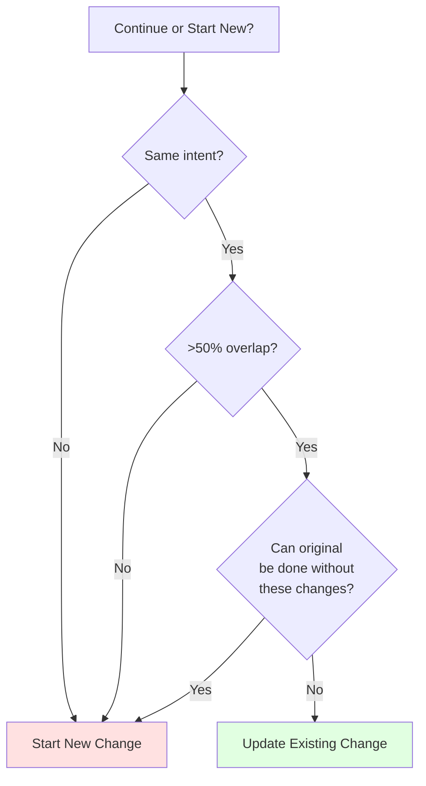

# Change Guidance

Guidance for AI agents working with OpenSpec changes.

## Keep Changes Focused

One logical unit of work per change. If you're doing "add feature X and also refactor Y", consider two separate changes.

**Why it matters:**

- Easier to review and understand
- Cleaner archive history
- Can ship independently
- Simpler rollback if needed

## When to Update vs Start Fresh

A common question: when is updating an existing change okay, and when should you start a new one?

**Update existing change when:**

- Same intent, refined execution
- Scope narrows (MVP first, rest later)
- Learning-driven corrections (codebase isn't what you expected)
- Design tweaks based on implementation discoveries

**Start a new change when:**

- Intent fundamentally changed
- Scope exploded to different work entirely
- Original change can be marked "done" standalone
- Patches would confuse more than clarify



**Example: "Add dark mode"**

- "Need to also support custom themes" → New change (scope exploded)
- "System preference detection is harder than expected" → Update (same intent)
- "Let's ship toggle first, add preferences later" → Update then archive, then new change

## Name Changes Clearly

Good names make changes easy to identify:

```
Good:                          Avoid:
add-dark-mode                  feature-1
fix-login-redirect             update
optimize-product-query         changes
implement-2fa                  wip
```

Use descriptive, verb-first naming that explains what the change does.
