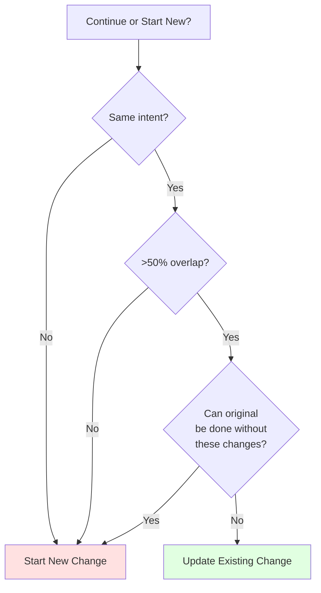
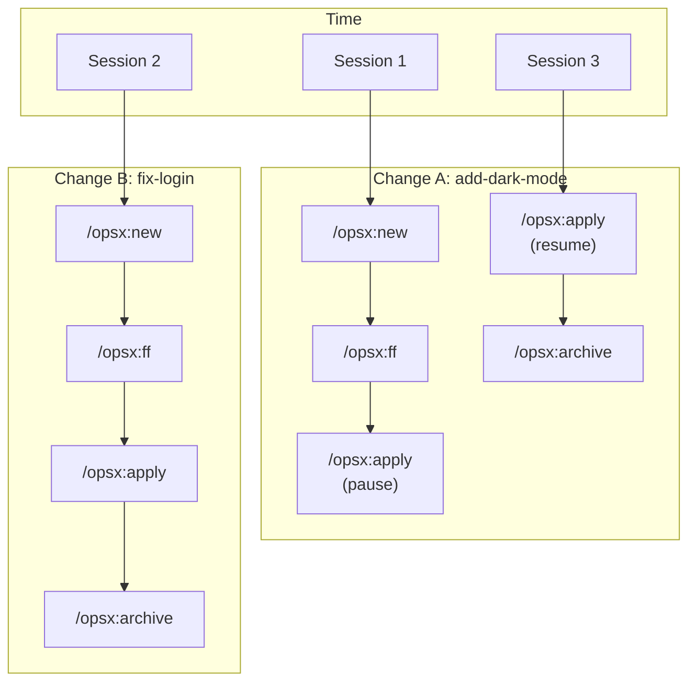
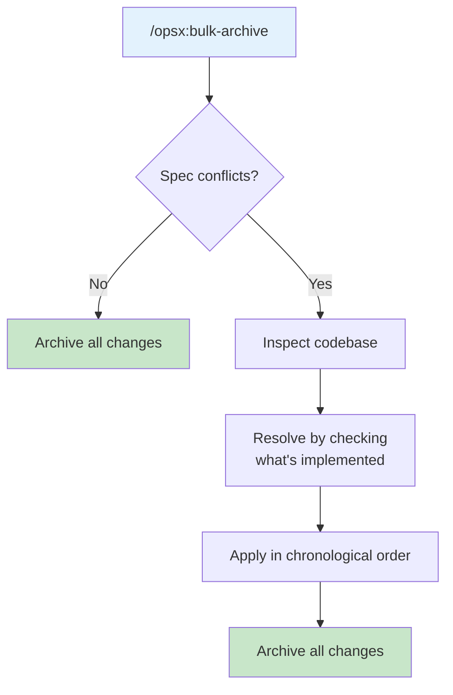

# Change Guidance

Guidance for AI agents working with OpenSpec changes.

## Keep Changes Focused

One logical unit of work per change. If you're doing "add feature X and also refactor Y", consider two separate changes.

**Why it matters:**

- Easier to review and understand
- Cleaner archive history
- Can ship independently
- Simpler rollback if needed

## When to Update vs Start Fresh

A common question: when is updating an existing change okay, and when should you start a new one?

**Update existing change when:**

- Same intent, refined execution
- Scope narrows (MVP first, rest later)
- Learning-driven corrections (codebase isn't what you expected)
- Design tweaks based on implementation discoveries

**Start a new change when:**

- Intent fundamentally changed
- Scope exploded to different work entirely
- Original change can be marked "done" standalone
- Patches would confuse more than clarify



**Example: "Add dark mode"**

- "Need to also support custom themes" → New change (scope exploded)
- "System preference detection is harder than expected" → Update (same intent)
- "Let's ship toggle first, add preferences later" → Update then archive, then new change

## Name Changes Clearly

Good names make changes easy to identify:

```
Good:                          Avoid:
add-dark-mode                  feature-1
fix-login-redirect             update
optimize-product-query         changes
implement-2fa                  wip
```

Use descriptive, verb-first naming that explains what the change does.

---

## Parallel Changes

OpenSpec supports working on multiple changes simultaneously. Each change is independent until archived.



### Switching Between Changes

```text
You: I'm working on add-dark-mode but need to fix a bug first

You: /opsx:new fix-login-redirect

AI:  Created openspec/changes/fix-login-redirect/

You: /opsx:ff

AI:  ✓ Created planning artifacts

You: /opsx:apply

AI:  Working on fix-login-redirect...
     [Implements the fix]
     All tasks complete!

You: /opsx:archive

AI:  ✓ Archived fix-login-redirect

You: Back to dark mode

You: /opsx:apply add-dark-mode

AI:  Resuming add-dark-mode...
     Picking up at task 2.3: Update Header...
```

### Best Practices for Parallel Work

| Practice | Why |
|----------|-----|
| Keep changes independent | Avoid spec conflicts |
| Use explicit change names | `/opsx:apply <name>` instead of inference |
| Archive completed work | Reduces mental load |
| Check for conflicts before archive | `/opsx:bulk-archive` detects them |

---

## Bulk Archive

When multiple changes are complete, use bulk archive to finalize them together.

### When to Use

- End of sprint cleanup
- Multiple small changes completed
- Parallel work streams finished
- Before starting major new work

### Conflict Detection

Bulk archive automatically detects when multiple changes touch the same specs:



### Example

```text
You: /opsx:bulk-archive

AI:  Found 3 completed changes:
     - add-dark-mode (8/8 tasks complete)
     - fix-login-redirect (3/3 tasks complete)
     - update-footer (2/2 tasks complete)

     Checking for spec conflicts...
     ⚠ add-dark-mode and update-footer both touch specs/ui/

     Inspecting codebase to resolve...
     Both changes are implemented. Will apply in chronological order:
     1. add-dark-mode (created Jan 20)
     2. update-footer (created Jan 22)

     Archive all 3 changes?

You: Yes

AI:  ✓ Archived add-dark-mode
     ✓ Archived fix-login-redirect
     ✓ Archived update-footer
     Specs merged: add-dark-mode → update-footer
```

### Conflict Resolution Strategy

When conflicts exist, bulk archive:

1. **Checks what's actually implemented** in the codebase
2. **Applies changes chronologically** (oldest first)
3. **Merges specs in order** so later changes include earlier ones

This works because:
- If both changes are implemented, the code already reflects the merged state
- Applying deltas in order ensures specs match the final code state

---

## When NOT to Use Bulk Archive

| Situation | Alternative |
|-----------|-------------|
| Changes have logical dependencies | Archive in order manually |
| One change blocks another | Archive blocking change first |
| Uncertain about implementation | Use `/opsx:verify` first |
| Large number of changes (>5) | Consider batching |
