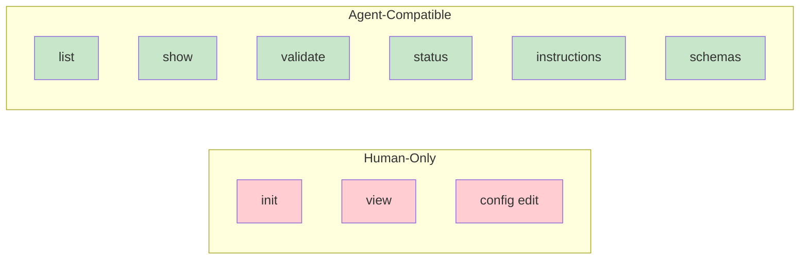

# CLI Reference for AI Agents

Condensed reference for OpenSpec CLI commands most useful to AI agents. For full documentation, see `research/openspec-cli.md`.

---

## Overview

The OpenSpec CLI (`openspec`) provides terminal commands complementary to AI slash commands. Many support `--json` output for programmatic use.



---

## Agent-Compatible Commands

### `openspec status`

Check artifact completion state for a change.

**Usage**:
```bash
openspec status --change <name> --json
```

**JSON Output**:
```json
{
  "change": "add-dark-mode",
  "schema": "spec-driven",
  "artifacts": [
    {"id": "proposal", "status": "complete", "path": "proposal.md"},
    {"id": "specs", "status": "complete", "path": "specs/"},
    {"id": "design", "status": "ready", "requires": ["proposal"]},
    {"id": "tasks", "status": "blocked", "requires": ["specs", "design"]}
  ],
  "next": "design"
}
```

**Status values**:
| Status | Meaning |
|--------|---------|
| `complete` | File/directory exists |
| `ready` | Dependencies met, can create |
| `blocked` | Missing dependencies |

---

### `openspec instructions`

Get enriched instructions for creating an artifact.

**Usage**:
```bash
# Get instructions for next ready artifact
openspec instructions --change <name> --json

# Get instructions for specific artifact
openspec instructions <artifact> --change <name> --json

# Get apply/implementation instructions
openspec instructions apply --change <name> --json
```

**Artifact IDs**:
- `proposal` - Change proposal
- `specs` - Specifications
- `design` - Technical design
- `tasks` - Implementation tasks
- `apply` - Task implementation instructions

**JSON Output**:
```json
{
  "artifact": "design",
  "template": "# Design Template\n\n## Technical Approach...",
  "dependencies": [
    {"id": "proposal", "path": "proposal.md", "done": true}
  ],
  "unlocks": ["tasks"],
  "context": "Tech stack: TypeScript...",
  "rules": ["Include sequence diagrams for complex flows"]
}
```

### Project Configuration Integration

The `openspec instructions` command automatically includes context from `openspec/config.yaml`:

| Field | JSON Key | How It's Applied |
|-------|----------|------------------|
| `context` | `context` | Prepend to all artifact instructions |
| `rules.<artifact>` | `rules` | Inject only for matching artifact |

**Example config.yaml**:
```yaml
schema: spec-driven

context: |
  Tech stack: TypeScript, React, Node.js
  API conventions: RESTful, JSON responses
  Testing: Vitest for unit tests, Playwright for e2e

rules:
  proposal:
    - Include rollback plan
    - Identify affected teams
  design:
    - Include sequence diagrams for complex flows
```

**Key insight**: When you call `openspec instructions design --json`, the response automatically includes `context` (applies to all artifacts) and `rules` (only design-specific rules). This means AI agents receive project-specific guidance without explicitly reading the config file.

---

### `openspec list`

List changes or specs in the project.

**Usage**:
```bash
# List active changes (default)
openspec list --json

# List specs
openspec list --specs --json

# Sort options
openspec list --sort recent  # default
openspec list --sort name
```

**JSON Output**:
```json
{
  "changes": [
    {"name": "add-dark-mode", "description": "UI theme switching"},
    {"name": "fix-login-bug", "description": "Session timeout handling"}
  ]
}
```

---

### `openspec show`

Display details of a change or spec.

**Usage**:
```bash
# Interactive selection
openspec show

# Specific change
openspec show <name> --json

# Specific spec
openspec show <domain> --type spec --json

# Show only delta specs
openspec show <name> --deltas-only --json
```

**JSON Output (change)**:
```json
{
  "name": "add-dark-mode",
  "path": "openspec/changes/add-dark-mode",
  "artifacts": {
    "proposal": {"exists": true, "path": "proposal.md"},
    "design": {"exists": true, "path": "design.md"},
    "tasks": {"exists": true, "path": "tasks.md", "completed": 6, "total": 8},
    "specs": {"exists": true, "files": ["specs/ui/spec.md"]}
  }
}
```

---

### `openspec validate`

Validate changes and specs for issues.

**Usage**:
```bash
# Interactive
openspec validate

# Specific change
openspec validate <name> --json

# All changes
openspec validate --changes --json

# Everything
openspec validate --all --json

# Strict mode
openspec validate --all --strict --json
```

**JSON Output**:
```json
{
  "version": "1.0.0",
  "results": {
    "changes": [
      {
        "name": "add-dark-mode",
        "valid": true,
        "warnings": ["design.md: missing 'Technical Approach' section"]
      }
    ],
    "specs": [
      {"name": "auth", "valid": true, "warnings": []}
    ]
  },
  "summary": {
    "total": 2,
    "valid": 2,
    "invalid": 0
  }
}
```

---

### `openspec schemas`

List available workflow schemas.

**Usage**:
```bash
openspec schemas --json
```

**JSON Output**:
```json
{
  "schemas": [
    {
      "name": "spec-driven",
      "source": "package",
      "description": "The default spec-driven development workflow",
      "artifacts": ["proposal", "specs", "design", "tasks"]
    },
    {
      "name": "my-custom",
      "source": "project",
      "description": "Custom workflow for this project",
      "artifacts": ["research", "proposal", "tasks"]
    }
  ]
}
```

---

### `openspec templates`

Show resolved template paths for a schema.

**Usage**:
```bash
openspec templates --schema <name> --json
```

**JSON Output**:
```json
{
  "schema": "spec-driven",
  "templates": {
    "proposal": "/usr/local/lib/openspec/schemas/spec-driven/templates/proposal.md",
    "specs": "/usr/local/lib/openspec/schemas/spec-driven/templates/specs.md",
    "design": "/usr/local/lib/openspec/schemas/spec-driven/templates/design.md",
    "tasks": "/usr/local/lib/openspec/schemas/spec-driven/templates/tasks.md"
  }
}
```

---

## Schema Commands

### `openspec schema init`

Create a new project-local schema.

```bash
openspec schema init <name> --artifacts "proposal,tasks" --description "Rapid workflow"
```

### `openspec schema fork`

Copy an existing schema for customization.

```bash
openspec schema fork spec-driven my-workflow
```

### `openspec schema validate`

Validate schema structure.

```bash
openspec schema validate <name>
```

### `openspec schema which`

Show where a schema resolves from.

```bash
openspec schema which <name>
openspec schema which --all
```

---

## Other Useful Commands

### `openspec archive`

Archive a completed change (non-interactive).

```bash
openspec archive <name> --yes
openspec archive <name> --skip-specs  # for tooling/doc-only changes
```

---

## Quick Reference Table

| Command | Purpose | JSON Support |
|---------|---------|--------------|
| `status --change <name> --json` | Artifact states | ✓ |
| `instructions <artifact> --change <name> --json` | Creation instructions | ✓ |
| `list --json` | List changes/specs | ✓ |
| `show <name> --json` | Show details | ✓ |
| `validate --all --json` | Validate everything | ✓ |
| `schemas --json` | List schemas | ✓ |
| `templates --json` | Template paths | ✓ |

---

## Common Patterns for AI Agents

### Check what's ready to create:
```bash
openspec status --change add-dark-mode --json
# Read "next" field to know what artifact to create
```

### Get instructions for creating an artifact:
```bash
openspec instructions design --change add-dark-mode --json
# Read template, dependencies, context, rules
```

### Validate before archiving:
```bash
openspec validate add-dark-mode --json
# Check "valid" and "warnings" fields
```

### Find available schemas:
```bash
openspec schemas --json
# Read "schemas" array for options
```

---

## Environment Variables

| Variable | Description |
|----------|-------------|
| `OPENSPEC_CONCURRENCY` | Parallel validation (default: 6) |
| `NO_COLOR` | Disable color output |

---

## Related Documentation

- `research/openspec-cli.md` - Full CLI reference
- `opsx-lifecycle.md` - Workflow lifecycle details
- `artifact-formats.md` - Project configuration (config.yaml) structure
