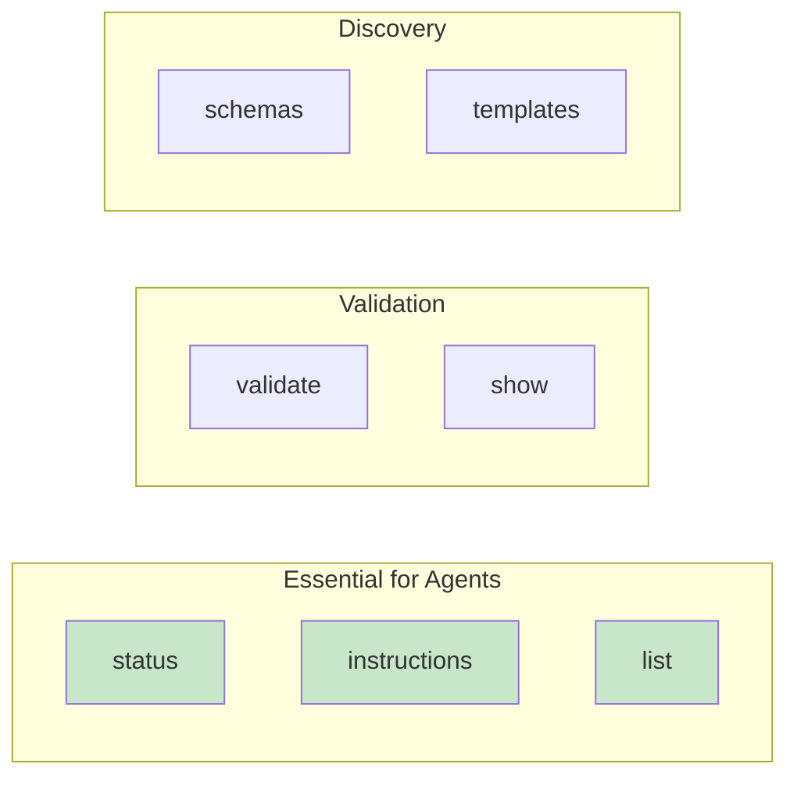

# CLI Reference for AI Agents

Condensed reference for OpenSpec CLI commands most useful to AI agents, with complete JSON output schemas for programmatic use.

---

## Overview

The OpenSpec CLI (`openspec`) provides terminal commands complementary to AI slash commands. All agent-compatible commands support `--json` output.



---

## Essential Commands

### `openspec status`

Check artifact completion state for a change. **Most commonly used command for agents.**

**Usage**:
```bash
openspec status --change <name> --json
```

**JSON Output Schema**:
```typescript
interface StatusOutput {
  change: string;           // Change name
  schema: string;           // Schema name (e.g., "spec-driven")
  artifacts: Artifact[];    // Artifact states
  next?: string;            // Next artifact ready to create (if any)
  isComplete: boolean;      // All artifacts done
}

interface Artifact {
  id: string;               // Artifact ID (proposal, specs, design, tasks)
  status: "done" | "ready" | "blocked";
  path?: string;            // File path if exists
  requires?: string[];      // Dependencies if blocked
}
```

**Example Output**:
```json
{
  "change": "add-dark-mode",
  "schema": "spec-driven",
  "artifacts": [
    {"id": "proposal", "status": "done", "path": "proposal.md"},
    {"id": "specs", "status": "done", "path": "specs/"},
    {"id": "design", "status": "ready", "requires": ["proposal"]},
    {"id": "tasks", "status": "blocked", "requires": ["specs", "design"]}
  ],
  "next": "design",
  "isComplete": false
}
```

**Status Values**:
| Status | Meaning | Action |
|--------|---------|--------|
| `done` | File/directory exists | Can read, no action needed |
| `ready` | Dependencies met | Can create now |
| `blocked` | Missing dependencies | Create dependencies first |

**Agent Usage Pattern**:
```bash
# Always check status before creating artifacts
openspec status --change "add-dark-mode" --json

# Parse output:
# - If "next" exists, create that artifact
# - If "isComplete" is true, ready for apply
# - If all "blocked", need to work on dependencies
```

---

### `openspec instructions`

Get enriched instructions for creating an artifact. **Essential for understanding what to write.**

**Usage**:
```bash
# Get instructions for next ready artifact
openspec instructions --change <name> --json

# Get instructions for specific artifact
openspec instructions <artifact> --change <name> --json

# Get apply/implementation instructions
openspec instructions apply --change <name> --json
```

**JSON Output Schema**:
```typescript
interface InstructionsOutput {
  artifact: string;         // Artifact ID
  template: string;         // Markdown template
  dependencies: Dependency[]; // Required context files
  unlocks: string[];        // What becomes ready after creating
  context?: string;         // Project context (from config.yaml)
  rules?: string[];         // Artifact-specific rules
}

interface Dependency {
  id: string;               // Artifact ID
  path: string;             // File path
  done: boolean;            // Whether dependency exists
}
```

**Example Output (design artifact)**:
```json
{
  "artifact": "design",
  "template": "# Design Template\n\n## Technical Approach\n\nDescribe your technical approach...\n\n## Architecture Decisions\n\n### Decision 1: [Title]\n...",
  "dependencies": [
    {"id": "proposal", "path": "openspec/changes/add-dark-mode/proposal.md", "done": true}
  ],
  "unlocks": ["tasks"],
  "context": "Tech stack: TypeScript, React, Node.js\nAPI conventions: RESTful, JSON responses\nTesting: Vitest for unit tests",
  "rules": [
    "Include sequence diagrams for complex flows",
    "Document tradeoffs for major decisions"
  ]
}
```

**Example Output (apply instructions)**:
```json
{
  "artifact": "apply",
  "contextFiles": [
    "openspec/changes/add-dark-mode/tasks.md",
    "openspec/changes/add-dark-mode/design.md",
    "openspec/changes/add-dark-mode/specs/"
  ],
  "context": "Tech stack: TypeScript...",
  "rules": [
    "Mark tasks complete immediately after implementation",
    "Update design if implementation reveals issues"
  ]
}
```

**Agent Usage Pattern**:
```bash
# Before creating artifact
openspec instructions design --change "add-dark-mode" --json

# Parse output:
# 1. Read all "dependencies" files first
# 2. Use "template" as starting structure
# 3. Follow "rules" for artifact-specific guidance
# 4. Note what "unlocks" to inform user of progress
```

---

### `openspec list`

List changes or specs in the project.

**Usage**:
```bash
# List active changes (default)
openspec list --json

# List specs
openspec list --specs --json

# Sort options
openspec list --sort recent  # default
openspec list --sort name
```

**JSON Output Schema (changes)**:
```typescript
interface ListChangesOutput {
  changes: Change[];
}

interface Change {
  name: string;             // Change folder name
  description?: string;     // From proposal intent (if parsed)
  schema?: string;          // Schema name
  created?: string;         // ISO date string
  status?: "active" | "archived";
}
```

**Example Output**:
```json
{
  "changes": [
    {"name": "add-dark-mode", "description": "UI theme switching", "schema": "spec-driven"},
    {"name": "fix-login-bug", "description": "Session timeout handling", "schema": "spec-driven"}
  ]
}
```

**JSON Output Schema (specs)**:
```typescript
interface ListSpecsOutput {
  specs: Spec[];
}

interface Spec {
  domain: string;           // Domain name (e.g., "auth", "ui")
  path: string;             // Path to spec directory
  requirements?: number;    // Count of requirements
}
```

**Example Output**:
```json
{
  "specs": [
    {"domain": "auth", "path": "openspec/specs/auth/", "requirements": 5},
    {"domain": "ui", "path": "openspec/specs/ui/", "requirements": 3}
  ]
}
```

**Agent Usage Pattern**:
```bash
# When user doesn't specify change name
openspec list --json

# If single change: use it
# If multiple changes: use AskUserQuestion tool to select
# If no changes: suggest /opsx:new to create one
```

---

## Validation Commands

### `openspec validate`

Validate changes and specs for issues.

**Usage**:
```bash
# Interactive
openspec validate

# Specific change
openspec validate <name> --json

# All changes
openspec validate --changes --json

# Everything
openspec validate --all --json

# Strict mode (warnings become errors)
openspec validate --all --strict --json
```

**JSON Output Schema**:
```typescript
interface ValidateOutput {
  version: string;          // Validator version
  results: {
    changes: ValidationResult[];
    specs: ValidationResult[];
  };
  summary: {
    total: number;
    valid: number;
    invalid: number;
    warnings: number;
  };
}

interface ValidationResult {
  name: string;
  valid: boolean;
  errors: string[];         // Critical issues
  warnings: string[];       // Non-critical issues
}
```

**Example Output**:
```json
{
  "version": "1.0.0",
  "results": {
    "changes": [
      {
        "name": "add-dark-mode",
        "valid": true,
        "errors": [],
        "warnings": ["design.md: missing 'Technical Approach' section"]
      }
    ],
    "specs": [
      {"name": "auth", "valid": true, "errors": [], "warnings": []}
    ]
  },
  "summary": {
    "total": 2,
    "valid": 2,
    "invalid": 0,
    "warnings": 1
  }
}
```

**Agent Usage Pattern**:
```bash
# Before archiving
openspec validate add-dark-mode --json

# If "valid" is false: show errors, don't archive
# If "warnings" exist: inform user, ask if they want to proceed
```

---

### `openspec show`

Display details of a change or spec.

**Usage**:
```bash
# Interactive selection
openspec show

# Specific change
openspec show <name> --json

# Specific spec
openspec show <domain> --type spec --json

# Show only delta specs
openspec show <name> --deltas-only --json
```

**JSON Output Schema (change)**:
```typescript
interface ShowChangeOutput {
  name: string;
  path: string;
  schema: string;
  artifacts: {
    proposal?: {exists: boolean; path: string};
    specs?: {exists: boolean; path: string; files: string[]};
    design?: {exists: boolean; path: string};
    tasks?: {exists: boolean; path: string; completed: number; total: number};
  };
  created?: string;
  modified?: string;
}
```

**Example Output**:
```json
{
  "name": "add-dark-mode",
  "path": "openspec/changes/add-dark-mode",
  "schema": "spec-driven",
  "artifacts": {
    "proposal": {"exists": true, "path": "proposal.md"},
    "design": {"exists": true, "path": "design.md"},
    "tasks": {"exists": true, "path": "tasks.md", "completed": 6, "total": 8},
    "specs": {"exists": true, "path": "specs/", "files": ["specs/ui/spec.md"]}
  },
  "created": "2025-01-20T10:00:00Z",
  "modified": "2025-01-22T14:30:00Z"
}
```

---

## Discovery Commands

### `openspec schemas`

List available workflow schemas.

**Usage**:
```bash
openspec schemas --json
```

**JSON Output Schema**:
```typescript
interface SchemasOutput {
  schemas: Schema[];
}

interface Schema {
  name: string;
  source: "package" | "project" | "user";
  description: string;
  artifacts: string[];      // Artifact IDs in dependency order
}
```

**Example Output**:
```json
{
  "schemas": [
    {
      "name": "spec-driven",
      "source": "package",
      "description": "The default spec-driven development workflow",
      "artifacts": ["proposal", "specs", "design", "tasks"]
    },
    {
      "name": "research-first",
      "source": "project",
      "description": "Research before planning",
      "artifacts": ["research", "proposal", "tasks"]
    }
  ]
}
```

---

### `openspec templates`

Show resolved template paths for a schema.

**Usage**:
```bash
openspec templates --schema <name> --json
```

**Example Output**:
```json
{
  "schema": "spec-driven",
  "templates": {
    "proposal": "/path/to/templates/proposal.md",
    "specs": "/path/to/templates/specs.md",
    "design": "/path/to/templates/design.md",
    "tasks": "/path/to/templates/tasks.md"
  }
}
```

---

## Project Configuration

### How `config.yaml` Affects CLI Output

The `openspec/config.yaml` file injects context into `instructions` output:

```yaml
schema: spec-driven

context: |
  Tech stack: TypeScript, React, Node.js
  API conventions: RESTful, JSON responses
  Testing: Vitest for unit tests, Playwright for e2e

rules:
  proposal:
    - Include rollback plan
    - Identify affected teams
  design:
    - Include sequence diagrams for complex flows
```

**Field Mapping**:
| config.yaml Field | JSON Key | Applied To |
|-------------------|----------|------------|
| `context` | `context` | All artifact instructions |
| `rules.<artifact>` | `rules` | Only matching artifact |

**Key Insight**: When calling `openspec instructions`, the response automatically includes project-specific context and rules. No need to read config.yaml separately.

---

## Quick Reference Table

| Command | Purpose | JSON Output Key Fields |
|---------|---------|------------------------|
| `status --change <name> --json` | Artifact states | `artifacts[]`, `next`, `isComplete` |
| `instructions <artifact> --change <name> --json` | Creation guide | `template`, `dependencies`, `rules` |
| `list --json` | List changes | `changes[]` |
| `validate <name> --json` | Check issues | `valid`, `errors[]`, `warnings[]` |
| `show <name> --json` | Change details | `artifacts`, `completed/total` |
| `schemas --json` | Available schemas | `schemas[]` |

---

## Common Patterns for AI Agents

### Pattern 1: Starting Work on a Change

```bash
# 1. Check what exists
openspec status --change "add-dark-mode" --json

# 2. If "next" exists, get instructions
openspec instructions design --change "add-dark-mode" --json

# 3. Read dependencies, use template, follow rules
# 4. Create artifact file
```

### Pattern 2: Selecting a Change to Work On

```bash
# 1. List available changes
openspec list --json

# 2. If multiple: use AskUserQuestion tool
# 3. If single: use it directly
# 4. If none: suggest /opsx:new
```

### Pattern 3: Before Archiving

```bash
# 1. Validate
openspec validate add-dark-mode --json

# 2. Check for errors/warnings
# 3. If valid: proceed to archive
# 4. If invalid: fix issues first
```

### Pattern 4: During Apply Phase

```bash
# Get apply instructions (includes context files to read)
openspec instructions apply --change "add-dark-mode" --json

# Parse contextFiles array and read each before implementing
```

---

## Error Handling

### Common Error Patterns

| Error | Cause | Solution |
|-------|-------|----------|
| `Change not found` | Invalid name | Run `openspec list --json` to see valid names |
| `Artifact blocked` | Missing deps | Check `requires` field, create deps first |
| `Invalid YAML` | config.yaml syntax | Validate YAML structure |
| `Schema not found` | Unknown schema | Run `openspec schemas --json` to see options |

### Error Output Format

```json
{
  "error": {
    "code": "CHANGE_NOT_FOUND",
    "message": "Change 'foo' not found",
    "suggestions": ["add-dark-mode", "fix-login-bug"]
  }
}
```

---

## Environment Variables

| Variable | Description | Default |
|----------|-------------|---------|
| `OPENSPEC_CONCURRENCY` | Parallel validation threads | 6 |
| `NO_COLOR` | Disable color output | false |
| `OPENSPEC_CONFIG` | Path to config file | `openspec/config.yaml` |

---

## Related Documentation

- Main skill: `../SKILL.md`
- `references/opsx-lifecycle.md` - Workflow lifecycle details
- `references/artifact-formats.md` - Artifact structure
- `research/openspec-cli.md` - Upstream CLI reference (project-level)
