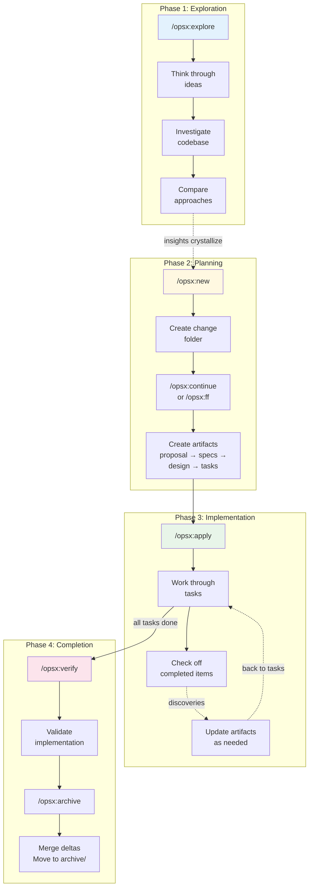
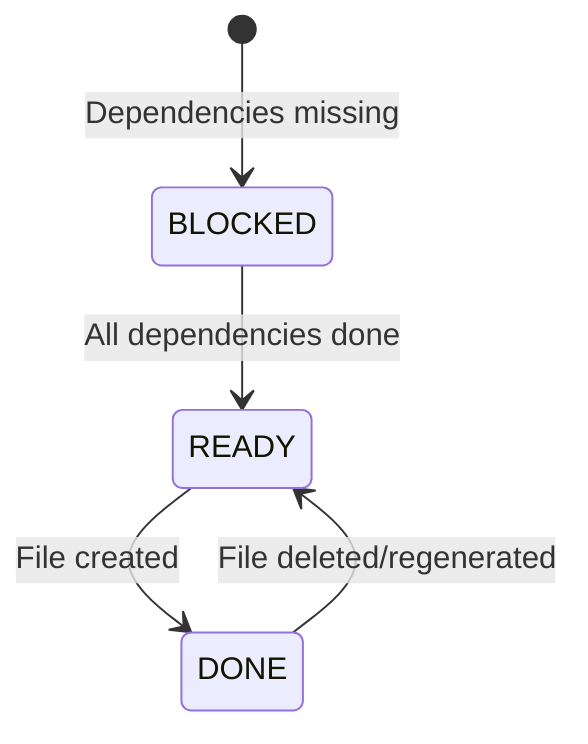
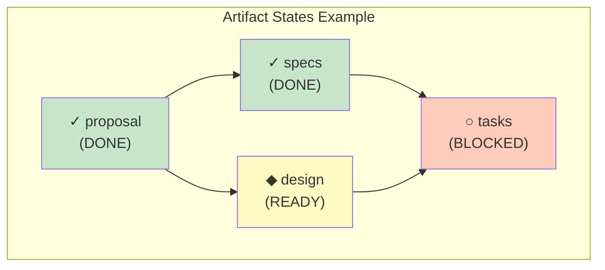

# OPSX Lifecycle Reference

Detailed guide to the OPSX workflow lifecycle, state transitions, and usage patterns.

---

## Overview

OPSX (OpenSpec Extended) is a **fluid, iterative workflow** for OpenSpec changes. Commands are actions you can take anytime—dependencies enable what's possible, they don't lock you into phases.

---

## Complete Lifecycle Flow



---

## State Transitions

### Artifact States

Each artifact can be in one of three states:



| State | Symbol | Meaning | Example |
|-------|--------|---------|---------|
| `BLOCKED` | ○ | Dependencies not met | `tasks` waiting for `specs` and `design` |
| `READY` | ◆ | Can create now | `specs` ready after `proposal` exists |
| `DONE` | ✓ | File exists | `proposal.md` created |

### Dependency Graph (spec-driven schema)



In this example:
- `proposal` is done (file exists)
- `specs` is done (file exists)
- `design` is ready (depends only on `proposal`, which is done)
- `tasks` is blocked (needs both `specs` and `design`, but `design` not done yet)

---

## Command Deep Dive

### `/opsx:explore`

Think through ideas before committing to a change.

**When to use**:
- Requirements are unclear
- Multiple approaches exist
- Need to investigate codebase first
- Performance or architectural questions

**What it does**:
- Opens unstructured conversation
- Can read files, search codebase
- Creates diagrams to clarify thinking
- No artifacts created

**Transition to next phase**:
```
You: /opsx:explore
AI:  What would you like to explore?
You: How should we handle rate limiting?
AI:  [investigates...]
     I see three approaches:
     1. Middleware-based
     2. Redis-backed
     3. Token bucket
     
     Which direction?
You: Let's go with Redis. Start a change?
AI:  Ready when you are. Run /opsx:new add-rate-limiting
```

---

### `/opsx:new`

Start a new change folder.

**What it creates**:
```
openspec/changes/<change-name>/
└── .openspec.yaml    # Metadata (schema, created date)
```

**Options**:
- `--schema <name>` - Use specific workflow schema

**Example**:
```
You: /opsx:new add-dark-mode
AI:  Created openspec/changes/add-dark-mode/
     Schema: spec-driven
     
     Ready to create: proposal
     Use /opsx:continue or /opsx:ff
```

---

### `/opsx:continue`

Create the next artifact incrementally.

**What it does**:
1. Queries dependency graph
2. Shows which artifacts are ready vs blocked
3. Creates the first ready artifact
4. Shows what becomes available next

**Example output**:
```
Change: add-dark-mode

Artifact status:
✓ proposal    (done)
◆ specs       (ready)
◆ design      (ready)
○ tasks       (blocked - needs: specs, design)

Creating specs...
[Reads proposal.md, creates specs]

✓ Created openspec/changes/add-dark-mode/specs/ui/spec.md

Now available: tasks
Run /opsx:continue to create the next artifact.
```

---

### `/opsx:ff`

Fast-forward through all planning artifacts.

**When to use**:
- Clear picture of what you're building
- Small to medium features
- Time pressure

**What it does**:
- Creates all artifacts in dependency order
- Stops when apply-required artifacts are complete
- Shows progress with todo list

**Example**:
```
You: /opsx:ff add-dark-mode

AI:  Fast-forwarding add-dark-mode...
     
     ✓ Creating proposal.md
     ✓ Creating specs/ui/spec.md
     ✓ Creating design.md
     ✓ Creating tasks.md
     
     All planning artifacts complete!
     Ready for implementation. Run /opsx:apply to begin.
```

---

### `/opsx:apply`

Implement tasks from the change.

**What it does**:
1. Reads `tasks.md`
2. Identifies incomplete tasks (`[ ]`)
3. Works through tasks one by one
4. Marks complete with `[x]`

**Iteration is fluid**:
- If design is wrong, edit `design.md` and continue
- If specs need update, edit delta specs
- Tasks track progress automatically

**Example**:
```
You: /opsx:apply

AI:  Implementing add-dark-mode...
     
     Reading tasks.md:
     - [ ] 1.1 Create ThemeContext
     - [ ] 1.2 Add CSS custom properties
     - [ ] 1.3 Implement localStorage persistence
     
     Working on 1.1: Create ThemeContext...
     [Creates src/context/ThemeContext.tsx]
     
     ✓ 1.1 Complete
     
     Working on 1.2...
```

**Resuming work**:
```
You: /opsx:apply add-dark-mode

AI:  Resuming add-dark-mode...
     Picking up at task 1.2: Add CSS custom properties...
```

---

### `/opsx:verify`

Validate implementation against artifacts.

**Three dimensions**:

| Dimension | Checks |
|-----------|--------|
| **Completeness** | All tasks done, requirements implemented, scenarios covered |
| **Correctness** | Implementation matches spec intent, edge cases handled |
| **Coherence** | Design decisions reflected in code, patterns consistent |

**Example output**:
```
You: /opsx:verify

AI:  Verifying add-dark-mode...
     
     COMPLETENESS
     ✓ All 8 tasks in tasks.md are checked
     ✓ All requirements in specs have corresponding code
     ⚠ Scenario "System preference detection" has no test
     
     CORRECTNESS
     ✓ Implementation matches spec intent
     ✓ Edge cases handled
     
     COHERENCE
     ✓ Design decisions reflected in code structure
     ⚠ Design mentions "CSS variables" but uses Tailwind classes
     
     SUMMARY
     Critical issues: 0
     Warnings: 2
     Ready to archive: Yes (with warnings)
```

---

### `/opsx:archive`

Complete the change and merge to main specs.

**What it does**:
1. Checks artifact completion status
2. Warns if tasks incomplete
3. Offers to sync delta specs
4. Moves to `archive/YYYY-MM-DD-<name>/`

**Example**:
```
You: /opsx:archive

AI:  Archiving add-dark-mode...
     
     Artifact status:
     ✓ proposal.md exists
     ✓ specs/ exists
     ✓ design.md exists
     ✓ tasks.md exists (8/8 tasks complete)
     
     Delta specs: Not yet synced
     → Sync now? (recommended)
     
You: Yes

AI:  ✓ Synced specs to openspec/specs/ui/spec.md
     ✓ Moved to openspec/changes/archive/2025-01-24-add-dark-mode/
     
     Change archived successfully.
```

---

### `/opsx:bulk-archive`

Archive multiple completed changes.

**When to use**:
- Parallel work streams completed
- Multiple small changes ready
- End of sprint cleanup

**Conflict resolution**:
- Detects when multiple changes touch same specs
- Checks what's actually implemented in codebase
- Applies in chronological order

**Example**:
```
You: /opsx:bulk-archive

AI:  Found 3 completed changes:
     - add-dark-mode (8/8 tasks)
     - fix-login-bug (3/3 tasks)
     - update-footer (2/2 tasks)
     
     Checking for spec conflicts...
     ⚠ add-dark-mode and update-footer both touch specs/ui/
     
     Inspecting codebase to resolve...
     Both changes are implemented. Will apply in order:
     1. add-dark-mode (created Jan 20)
     2. update-footer (created Jan 22)
     
     Archive all 3 changes?
```

---

## Schemas

Schemas define artifact types and their dependencies.

### Built-in Schema: spec-driven

```yaml
name: spec-driven
artifacts:
  - id: proposal
    generates: proposal.md
    requires: []
    
  - id: specs
    generates: specs/**/*.md
    requires: [proposal]
    
  - id: design
    generates: design.md
    requires: [proposal]
    
  - id: tasks
    generates: tasks.md
    requires: [specs, design]
```

### Custom Schemas

Create custom workflows:

```bash
# Create new schema
openspec schema init research-first

# Fork existing
openspec schema fork spec-driven my-workflow

# Validate
openspec schema validate my-workflow
```

**Example custom schema**:
```yaml
# openspec/schemas/research-first/schema.yaml
name: research-first
artifacts:
  - id: research
    generates: research.md
    requires: []
    
  - id: proposal
    generates: proposal.md
    requires: [research]
    
  - id: tasks
    generates: tasks.md
    requires: [proposal]
```

Dependency graph:
```
research → proposal → tasks
```

---

## Workflow Patterns

### Quick Feature Pattern

For straightforward changes with clear scope:

```
/opsx:new → /opsx:ff → /opsx:apply → /opsx:verify → /opsx:archive
```

### Exploratory Pattern

For unclear requirements:

```
/opsx:explore → [investigation] → /opsx:new → /opsx:continue → ... → /opsx:apply
```

### Parallel Changes Pattern

For multiple simultaneous changes:

```
Change A: /opsx:new → /opsx:ff → /opsx:apply (pause)
                                    │
                              context switch
                                    │
Change B: /opsx:new → /opsx:ff → /opsx:apply → /opsx:archive
                                    │
                              resume A
                                    │
Change A: /opsx:apply (resume) → /opsx:archive
```

---

## Related Documentation

- Main skill: `../SKILL.md`
- `references/cli-reference.md` - CLI commands for status and instructions
- `references/change-guidance.md` - When to update vs. start fresh
- `references/artifact-formats.md` - Detailed artifact structure
