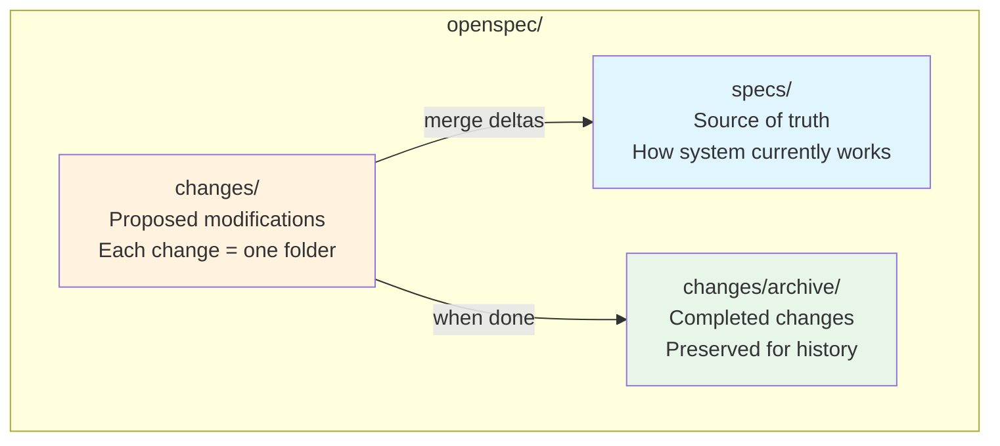
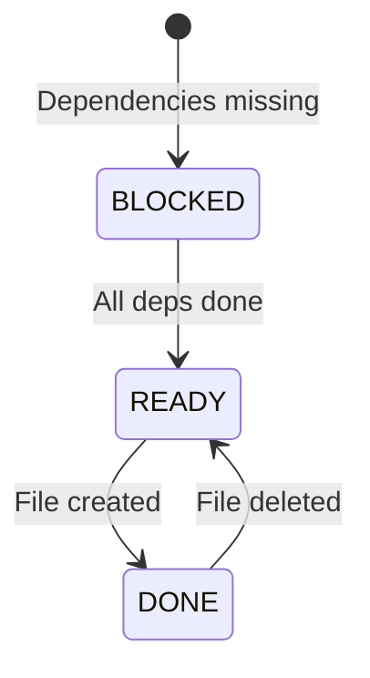
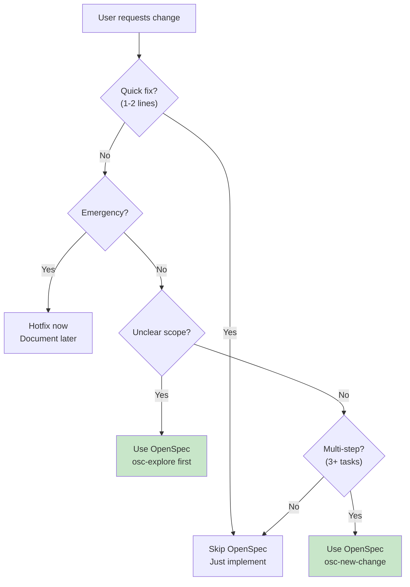

# OpenSpec for AI Agents

Guide to spec-driven development where you agree on WHAT to build before writing code. All artifacts live in the repository, enabling collaboration between humans and AI.

---

## TL;DR: Mental Model (30 Seconds)

**Core Insight**: Work isn't linear. OpenSpec embraces fluid actions, not rigid phases.

**What OpenSpec Is**: A framework where you:
1. Define WHAT to build (specs) before writing code
2. Track changes as self-contained folders with artifacts
3. Merge completed changes into the source of truth

**Skill Taxonomy**:

| Layer | Prefix | Source | Examples |
|-------|--------|--------|----------|
| **Core** | `osc-*` | Upstream (renamed from `openspec-*` by installer) | `osc-new-change` (was `openspec-new-change`), `osc-apply-change` (was `openspec-apply-change`) |
| **Extended** | `osx-*` | Local enhancements | `osx-review-artifacts`, `osx-modify-artifacts` |

**Artifact Flow**:

```
proposal ──→ specs ──→ design ──→ tasks ──→ implement
  (why)      (what)     (how)     (steps)
```

**Skip OpenSpec When**: 1-2 line fixes, emergency hotfixes, pure debugging.

---

## 1. Philosophy

### The Problem OpenSpec Solves

Traditional workflows pretend work is linear: plan → implement → done. Real work doesn't work that way. You implement, realize design was wrong, update specs, continue implementing. Linear phases fight against how work actually happens.

### OpenSpec's Answer

**Fluid actions, not rigid phases.**

Skills are things you can do anytime. Dependencies are enablers—they show what's possible, not what you must do next. You can:
- Start with `osc-new-change` (was `openspec-new-change`), then create artifacts one at a time
- Or use `osc-ff-change` (was `openspec-ff-change`) to create all artifacts at once
- During `osc-apply-change` (was `openspec-apply-change`), edit artifacts as you learn
- Run `osc-verify-change` (was `openspec-verify-change`) before archiving, or skip it entirely

### Four Principles

| Principle | Meaning | In Practice |
|-----------|---------|-------------|
| **Fluid not rigid** | No phase gates | Work doesn't fit linear phases |
| **Iterative not waterfall** | Learn as you build | Requirements change, understanding deepens |
| **Easy not complex** | Minimal ceremony | Get started in seconds |
| **Brownfield-first** | Works with existing code | Most work modifies existing systems |

---

## 2. Skill Taxonomy

### 2.1 Core Skills (osc-*)

Standard OpenSpec workflow skills from upstream. These implement the change lifecycle.

| Skill | Original Name | Purpose | When to Use |
|-------|---------------|---------|-------------|
| `osc-explore` | `openspec-explore` | Think through ideas without committing | Unclear requirements, investigation |
| `osc-new-change` | `openspec-new-change` | Create change folder | Beginning any new work |
| `osc-continue-change` | `openspec-continue-change` | Create next artifact incrementally | Step-by-step control, complex changes |
| `osc-ff-change` | `openspec-ff-change` | Create all artifacts at once | Clear scope, ready to build |
| `osc-apply-change` | `openspec-apply-change` | Implement tasks from tasks.md | Ready to write code |
| `osc-verify-change` | `openspec-verify-change` | Validate implementation | Before archiving (optional) |
| `osc-sync-specs` | `openspec-sync-specs` | Merge delta specs into main | Optional—archive prompts if needed |
| `osc-archive-change` | `openspec-archive-change` | Complete the change | All work finished |
| `osc-bulk-archive-change` | `openspec-bulk-archive-change` | Archive multiple changes | Parallel work completed |

### 2.2 Extended Skills (osx-*)

Local enhancements that augment core workflow with quality assurance, tracking, and documentation.

| Skill | Purpose | Augments | When to Use |
|-------|---------|----------|-------------|
| `osx-review-artifacts` | Pre-implementation quality check | `osc-ff-change` (was `openspec-ff-change`) | After creating artifacts, before `osc-apply` |
| `osx-modify-artifacts` | Edit artifacts with dependency tracking | Any artifact edit | Review feedback, requirement changes |
| `osx-review-test-compliance` | Spec-to-test alignment analysis | `osc-apply-change` (was `openspec-apply-change`) | After/during implementation |
| `osx-maintain-ai-docs` | Update AGENTS.md | Before `osc-archive` (was `openspec-archive-change`) | After implementation, before archive |
| `osx-generate-changelog` | Generate CHANGELOG.md | After `osc-archive` | Before release, after archiving |

### 2.3 Enhancement Patterns

How extended skills augment core workflow:

**Planning Phase** (core skills: `osc-*` renamed from `openspec-*`):
```
osc-ff-change → osx-review-artifacts → (issues found?) → osx-modify-artifacts → osc-apply-change
```

**Implementation Phase**:
```
osc-apply-change → osx-review-test-compliance → (gaps found?) → implement tests → continue
```

**Completion Phase**:
```
osx-maintain-ai-docs → osc-archive-change → osx-generate-changelog
```

**Artifact Modification** (anytime):
```
osx-modify-artifacts → (tracks dependents) → auto-update affected artifacts
```

---

## 3. Core Concepts

### 3.1 The Big Picture



**Specs** = source of truth (current behavior). **Changes** = proposed modifications. **Archive** = completed history.

### 3.2 Artifacts

Artifacts are documents within a change that guide the work:

| Artifact | Purpose | Contains |
|----------|---------|----------|
| `proposal.md` | Why & what | Intent, scope, approach, impact |
| `specs/` | Requirements | GIVEN/WHEN/THEN scenarios as deltas |
| `design.md` | How | Context, decisions, tradeoffs |
| `tasks.md` | Checklist | Progress-tracked `[ ]` / `[x]` items |

**For detailed artifact structure and examples**, read `references/artifact-formats.md`.

### 3.3 Delta Specs

Delta specs describe **what's changing** relative to current specs:

| Section | What Happens on Archive |
|---------|------------------------|
| `## ADDED Requirements` | Appended to main spec |
| `## MODIFIED Requirements` | Replaces existing requirement |
| `## REMOVED Requirements` | Deleted from main spec |

**Example**:

```markdown
## ADDED Requirements

### Requirement: Theme Selection

The system SHALL allow users to choose between light and dark themes.

#### Scenario: Manual toggle

- GIVEN a user on any page
- WHEN user clicks theme toggle
- THEN theme switches immediately
- AND preference persists across sessions

## MODIFIED Requirements

### Requirement: Session Expiration

The system MUST expire sessions after 15 minutes of inactivity.
(Previously: 30 minutes)
```

### 3.4 Artifact State Machine

Every artifact exists in one of three states:



| State | Symbol | Meaning | Example |
|-------|--------|---------|---------|
| `BLOCKED` | ○ | Dependencies not met | `tasks` waiting for `specs` and `design` |
| `READY` | ◆ | Can create now | `specs` ready after `proposal` exists |
| `DONE` | ✓ | File exists | `proposal.md` created |

**Query state anytime**:

```bash
openspec status --change "<name>" --json
```

---

## 4. Decision Guidance

### 4.1 When to Use OpenSpec



**Use OpenSpec when**: Multi-step (3+ tasks), refactors, architectural changes, unclear requirements, work spanning multiple sessions.

**Skip OpenSpec when**: Single obvious fixes (1-2 lines), emergency hotfixes, pure debugging/investigation.

### 4.2 Update vs New Change

| Test | Update Existing | Start New Change |
|------|-----------------|------------------|
| **Identity** | "Same thing, refined" | "Different work" |
| **Scope overlap** | >50% overlaps | <50% overlaps |
| **Completion** | Can't finish original without changes | Original done, new work stands alone |

**For detailed guidance**, read `references/change-guidance.md`.

### 4.3 Continue vs Fast-Forward

| Situation | Use |
|-----------|-----|
| Clear requirements, ready to build | `osc-ff-change` |
| Exploring, want to review each step | `osc-continue-change` |
| Complex change, want control | `osc-continue-change` |
| Time pressure, need to move fast | `osc-ff-change` |

---

## 5. Workflow Patterns

> **Note**: Core skills (`osc-*`) are renamed from upstream `openspec-*` names by the installer. Both names refer to the same functionality.

### Quick Feature Pattern

```
osc-new-change → osc-ff-change → osc-apply-change → osc-verify-change → osc-archive-change
```

### Exploratory Pattern

```
osc-explore → [investigation] → osc-new-change → osc-continue-change → ... → osc-apply-change
```

### Parallel Changes Pattern

```
Change A: osc-new-change → osc-ff-change → osc-apply-change (pause)
                                              │
                                        context switch
                                              │
Change B: osc-new-change → osc-ff-change → osc-apply-change → osc-archive-change
                                              │
                                        resume A
                                              │
Change A: osc-apply-change (resume) → osc-archive-change
```

### Enhanced Pattern (with extended skills)

```
osc-new-change → osc-ff-change → osx-review-artifacts → (fix issues with osx-modify-artifacts)
  → osc-apply-change → osx-review-test-compliance → osx-maintain-ai-docs
  → osc-archive-change → osx-generate-changelog
```

---

## 6. AI Behavior Guide

### 6.1 How to Approach OpenSpec Work

1. **Always check state first** - Run `openspec status --json` before acting
2. **Don't guess change names** - Use `openspec list --json` and AskUserQuestion tool
3. **Update artifacts as you learn** - If implementation reveals design issues, pause and update
4. **Read context before creating** - Use `openspec instructions --json` for dependencies
5. **Mark tasks complete immediately** - Update checkboxes right after finishing each task

### 6.2 Essential CLI Commands

| Command | When to Use | Key Output Fields |
|---------|-------------|-------------------|
| `openspec status --change <name> --json` | Before creating artifacts | `artifacts[]`, `next`, `isComplete` |
| `openspec instructions <artifact> --change <name> --json` | Before creating artifact | `template`, `dependencies`, `rules` |
| `openspec list --json` | When change name not specified | `changes[]` |
| `openspec validate <name> --json` | Before archiving | `valid`, `errors[]`, `warnings[]` |

**For full CLI reference with JSON schemas**, read `references/cli-reference.md`.

### 6.3 Handling Ambiguity

| Situation | Action |
|-----------|--------|
| Multiple active changes | Use AskUserQuestion tool to select |
| Artifact creation unclear | Read `dependencies` from instructions output |
| Implementation diverges from design | Pause, update design.md, continue |
| Tasks seem wrong | Update tasks.md to match reality, continue |
| User changes scope | Update proposal.md, ripple to affected artifacts |

### 6.4 Anti-Patterns Quick Reference

| # | Mistake | Quick Fix |
|---|---------|-----------|
| 1 | Creating artifacts out of order | Check `status --json` first |
| 2 | Guessing change name | Use `list --json` + AskUserQuestion |
| 3 | Never updating artifacts | Edit freely during apply phase |
| 4 | Vague requirements | Add measurable criteria + scenarios |
| 5 | Copying context/rules into artifacts | They're guidance for YOU, not content |
| 6 | Skipping spec updates | Always sync before/during archive |

**For comprehensive anti-patterns (16 total)**, read `references/anti-patterns.md`.

---

## 7. Autonomous Workflow

OpenSpec-extended includes an autonomous orchestrator (`osx-orchestrate`) that runs the 7-phase implementation loop.

### When to Use Autonomous vs Manual

**Use autonomous** when: Complex changes (3+ phases), want continuous execution, running full lifecycle.

**Use manual** when: Quick single-step tasks, need fine-grained control, debugging.

### Agent/Phase Mapping

| Phase | Agent | Key Skills |
|-------|-------|------------|
| PHASE0: Artifact Review | osx-analyzer | `osx-review-artifacts`, `osx-modify-artifacts` |
| PHASE1: Implementation | osx-builder | `osc-apply-change`, `osx-review-test-compliance` |
| PHASE2: Verification | osx-analyzer | `osc-verify-change` |
| PHASE3: Maintain Docs | osx-maintainer | `osx-maintain-ai-docs` |
| PHASE4: Sync | osx-maintainer | `osc-sync-specs` |
| PHASE5: Self-Reflection | osx-analyzer | (autonomous reasoning) |
| PHASE6: Archive | osx-maintainer | `osc-archive-change` |

**For complete autonomous workflow reference** (agent invocation, state management, phase details, blocker handling, error recovery), read `references/autonomous-workflow.md`.

---

## 8. Tool Naming Convention

| Prefix | Meaning | Source | Example |
|--------|---------|--------|---------|
| `openspec` | Core CLI tool | npm package | `openspec status`, `openspec new change` |
| `osc-*` | Core skills | Upstream (installer renames `openspec-*` → `osc-*`) | `osc-new-change` (was `openspec-new-change`), `osc-apply-change` (was `openspec-apply-change`) |
| `osx-*` | Extended skills | Local extensions | `osx-review-artifacts`, `osx-modify-artifacts` |
| `osx` | Lib tool | `.opencode/scripts/lib/osx` | `osx ctx get`, `osx state complete` |

**Critical**: When executing phase commands (PHASE0-PHASE6), the tool is `osx` lib tool, not `osc`.

---

## 9. Glossary

| Term | Definition |
|------|------------|
| **Artifact** | A document within a change (proposal, design, tasks, or delta specs) |
| **Archive** | Process of completing a change and merging its deltas into main specs |
| **Change** | A proposed modification, packaged as a folder with artifacts |
| **Delta spec** | A spec describing changes (ADDED/MODIFIED/REMOVED) relative to current specs |
| **Domain** | A logical grouping for specs (e.g., `auth/`, `payments/`) |
| **Requirement** | A specific behavior the system must have (SHALL/MUST/SHOULD) |
| **Scenario** | A concrete example in Given/When/Then format |
| **Schema** | Definition of artifact types and their dependencies |
| **Spec** | Specification containing requirements and scenarios |
| **Source of truth** | The `openspec/specs/` directory with current behavior |

---

## References

| File | Read When |
|------|-----------|
| `references/autonomous-workflow.md` | Executing PHASE0-PHASE6 commands, debugging orchestrator, understanding state management |
| `references/anti-patterns.md` | Making mistakes, need comprehensive catalog of what to avoid |
| `references/artifact-formats.md` | Creating artifacts, need detailed structure and examples |
| `references/cli-reference.md` | Need JSON output schemas for status/instructions/validate |
| `references/change-guidance.md` | Deciding whether to update existing change or start fresh |
