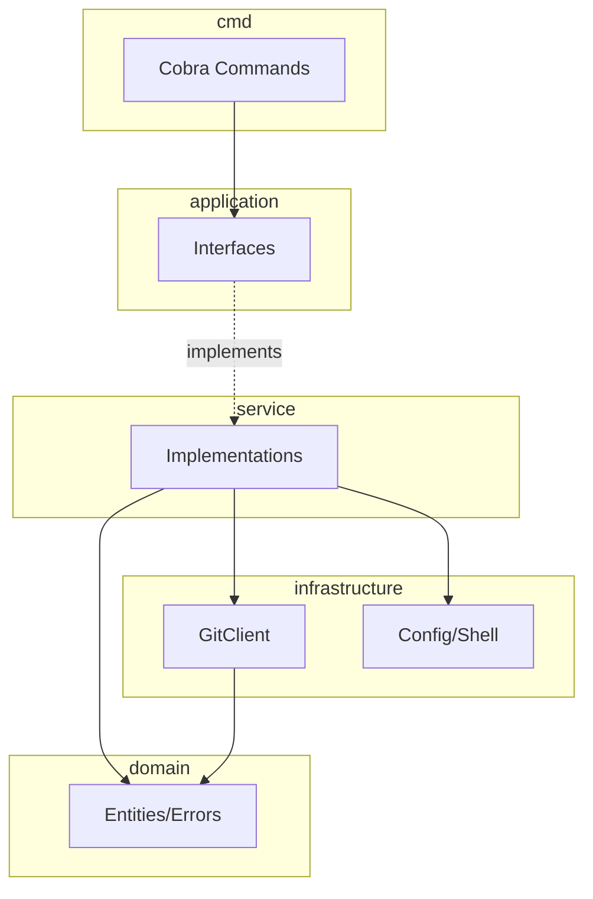
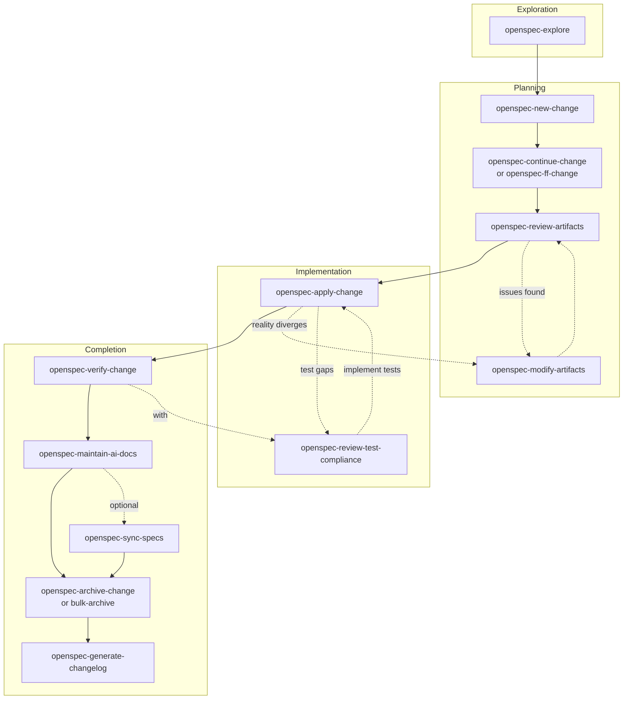

# Twiggit - OpenCode Reference

Pragmatic git worktree management tool with focus on rebase workflows.

## Architecture

## Essential Commands

| Command            | Purpose                                     |
| ------------------ | ------------------------------------------- |
| mise run test      | Quick tests                                 |
| mise run test:full | Full test suite (unit/integration/e2e/race) |
| mise run lint:fix  | Lint + format                               |
| mise run check     | All validation                              |
| mise run build     | Build binary                                |
| mise tasks         | List all tasks                              |

## Release

| Command                   | Purpose          |
| ------------------------- | ---------------- |
| mise run release:validate | Clean tree check |
| mise run release:dry-run  | Test GoReleaser  |

## Pre-Commit Hooks

Setup: `mise install && pre-commit install`
Run: `pre-commit run --all-files`
Skip: `git commit -m "msg" --no-verify`

## Specification Keywords

| Keyword       | Meaning              | Usage                  |
| ------------- | -------------------- | ---------------------- |
| SHALL         | Mandatory            | Critical functionality |
| SHALL NOT     | Absolute prohibition | Security boundaries    |
| SHOULD        | Recommended          | Conventional patterns  |
| SHOULD NOT    | Discouraged          | Anti-patterns          |
| WILL/WILL NOT | System facts         | Behavior declarations  |
| MAY/MAY NOT   | Optional             | Extensibility points   |

## OpenSpec Foundation

**Invoke `openspec-concepts` skill when:**
- Starting your first OpenSpec task in this project
- Confused about workflow, artifacts, or state transitions
- Multiple active changes exist and you need guidance choosing
- User asks "how does OpenSpec work?"

**How:** Use the skill tool with name `openspec-concepts`

## OpenSpec Workflow

**Config**: `openspec/config.yaml` (spec-driven schema)

### When to Use

| Situation | Action |
| --------- | ------ |
| Multi-step change (3+ tasks) | Use OpenSpec |
| Refactor / architectural change | Use OpenSpec |
| Quick fix (1-2 lines) | Skip OpenSpec |
| Unclear requirements | `openspec-explore` first |

### Lifecycle

### Skills by Phase

| Phase | Skill | Purpose |
| ----- | ----- | ------- |
| **Exploration** | `openspec-explore` | Think through ideas |
| **Planning** | `openspec-new-change` | Create change folder |
| | `openspec-continue-change` | Create one artifact |
| | `openspec-ff-change` | Create all artifacts at once |
| | `openspec-review-artifacts` | Review for quality |
| | `openspec-modify-artifacts` | Update artifacts *(also in Implementation)* |
| **Implementation** | `openspec-apply-change` | Implement tasks |
| | `openspec-review-test-compliance` | Check spec→test alignment *(also in Completion)* |
| **Completion** | `openspec-verify-change` | Validate implementation |
| | `openspec-maintain-ai-docs` | Update AGENTS.md |
| | `openspec-sync-specs` | Merge delta specs (optional) |
| | `openspec-archive-change` | Finalize single change |
| | `openspec-bulk-archive-change` | Archive multiple changes |
| | `openspec-generate-changelog` | Generate CHANGELOG.md |

### Project Conventions

| Rule | Detail |
| ---- | ------ |
| Tests | Written AFTER implementation (per config.yaml) |
| Progress | `openspec status --change <name> --json` |
| Artifacts | See `openspec/config.yaml` rules section |

## Troubleshooting

| Issue | Solution |
| ----- | -------- |
| ValidationError wrapping | Return directly, don't wrap with `fmt.Errorf` |
| `errors.As()` fails | Check error chain, ensure `Unwrap()` implemented |
| Context detection wrong | Check CWD, verify `.git` file in worktrees |
| Mock not matching calls | Verify `On()` args match actual call signature |

## Location-Specific Guides

| File | Purpose |
| ---- | ------- |
| [cmd/AGENTS.md](cmd/AGENTS.md) | CLI commands, Cobra patterns, command specs |
| [internal/application/AGENTS.md](internal/application/AGENTS.md) | Interface definitions |
| [internal/service/AGENTS.md](internal/service/AGENTS.md) | Service patterns, error handling |
| [internal/domain/AGENTS.md](internal/domain/AGENTS.md) | Domain model, context types, error types |
| [internal/infrastructure/AGENTS.md](internal/infrastructure/AGENTS.md) | Git client routing, config |
| [test/AGENTS.md](test/AGENTS.md) | Test organization, quality requirements |
| [test/mocks/AGENTS.md](test/mocks/AGENTS.md) | Mock patterns, testify/mock usage |
| [test/integration/AGENTS.md](test/integration/AGENTS.md) | Testify suite patterns |
| [test/e2e/AGENTS.md](test/e2e/AGENTS.md) | Ginkgo/Gomega CLI testing |
| [test/e2e/README.md](test/e2e/README.md) | E2E debugging, cleanup patterns |
| [test/e2e/fixtures/AGENTS.md](test/e2e/fixtures/AGENTS.md) | E2E fixture usage |
| [test/helpers/AGENTS.md](test/helpers/AGENTS.md) | Test utilities |
