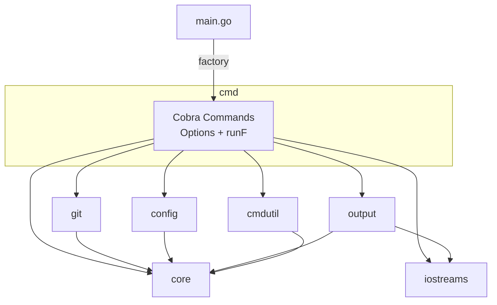

# Twiggit - OpenCode Reference

Pragmatic git worktree management tool with focus on rebase workflows.

## Architecture

Tier 2 layout (`golang-cli`): one functional core, one composition root,
and I/O adapters grouped by resource. The five-layer convention that pre-dates
`cli-functional-core-shell` is fully retired; the old `internal/{application,service,infrastructure,domain}/`
directories no longer exist.


```mermaid
graph TB
    main[main.go]
    subgraph cmd
        C[Cobra Commands<br/>Options + runF]
    end
    main -->|factory| C
    C --> core
    C --> cmdutil
    C --> output
    C --> iostreams
    C --> git
    C --> config
    git --> core
    config --> core
    output --> core
    output --> iostreams
    cmdutil --> core
    core
```

| Package | Role | Imports |
|---------|------|---------|
| `internal/core/` | Pure functional core: value objects, errors, validation, rules. No I/O. | stdlib, `github.com/samber/lo` |
| `internal/git/` | Git I/O adapter: client, reader, writer, hook runner, context resolver, shell probing. | stdlib, `lo`, `go-git`, `koanf`, `twiggit/internal/core` |
| `internal/config/` | koanf-backed config loader + XDG resolution. | stdlib, `koanf`, `twiggit/internal/core` |
| `internal/output/` | Formatter registry, error renderer, table writer, shell wrapper. | stdlib, `charm.land/lipgloss/v2`, `twiggit/internal/core`, `twiggit/internal/iostreams` |
| `internal/iostreams/` | TTY detection, IOStreams struct, lipgloss styles. | stdlib, `charm.land/lipgloss/v2`, `lo`, `golang.org/x/term` |
| `internal/cmdutil/` | `Factory` (functional-option construction; `WithVersion`/`WithConfigLoader`/`WithGitClientFactory`), `ExitCodeFor`, persistent flags, `HookRunner` consumer interface. | stdlib, `lo`, `twiggit/internal/core`, `twiggit/internal/iostreams` |
| `internal/version/` | Build-time version injection. | stdlib |
| `cmd/` | Cobra command tree (`list`, `create`, `delete`, `prune`, `cd`, `init`, `_carapace`, `version`). | everything above + `twiggit/cmd` |
| `main.go` | Composition root: Factory init, signal context, panic recover, cobra dispatch, exit-code mapping. | `twiggit/cmd`, `twiggit/internal/cmdutil`, `twiggit/internal/output` |

**Dependency rules are enforced by `.golangci.yml` depguard**; see
`openspec/changes/cli-functional-core-shell/design.md` for the rationale and
`openspec/changes/cli-functional-core-shell/proposal.md` §Lint for the rule
allow/deny lists.

## Toolchain Policy

Toolchain pins and linter/formatter posture are owned by `.mise/config.toml`,
`go.mod` (`tool` directive), and `.golangci.yml`. This section records the
**why** so future contributors do not re-litigate.

| Surface | Owner | Rule |
|---|---|---|
| Go toolchain | `go.mod` `go` directive + `.mise/config.toml` `go` | Bump together. Stay on the latest patch within the minor (currently `1.27.1`); security backports land in patches. |
| `golang.org/x/...` family | `go.mod` | Bump within `patch` scope on each release; reject major-version churn. `go.mod` is for code dependencies only — tool binaries (govulncheck, gocover-cobertura, etc.) live in `.mise/config.toml`. |
| `govulncheck` | `.mise/config.toml` `tools` | Pinned. Pre-commit and `mise run vuln:check` invoke the mise-installed binary. Never `@latest`. |
| `cosign` | `.mise/config.toml` `tools` | Pinned to match `goreleaser/goreleaser:v2.18.2` image bundle (`cosign v3.1.3`). CI `release` job signs SBOMs keyless via GitLab OIDC; local dev uses the mise-installed binary. Never `@latest`. |
| `syft` | `.mise/config.toml` `tools` (latest) for local `goreleaser release --snapshot`; bundled in `goreleaser/goreleaser:v2.18.2` image for CI | Both surfaces pin to a moving `latest`. Local dev installs via `mise install`; CI uses the image-bundled binary. The GitHub Actions release job runs inside the goreleaser Docker image as its job container (matching the GitLab CI pattern from `airk` and twiggit's own GitLab `release` job). The image bundles `goreleaser`, `syft`, `cosign`, and `gh`. |
| `gocover-cobertura` | `.mise/config.toml` `tools` | Pinned. `mise run ci:coverage` invokes the mise-installed binary for cobertura conversion. |
| `gocovmerge` | `.mise/config.toml` `tools` | Pinned. Available on PATH via `mise install` for downstream coverage merge workflows. |
| `golangci-lint` | `.mise/config.toml` + `.pre-commit-config.yaml` | Pinned to a single version; pre-commit reads from PATH so `mise install` provisions the matching binary. Update in one PR. |
| `gopls` | `.mise/config.toml` | Pinned to a single version. `mise run gopls:check` runs `gopls check ./...` across the module; `mise run gopls:stats` reports analysis state. |
| Linter set | `.golangci.yml` `linters.enable` | `nolintlint` MUST stay enabled so every `//nolint` directive is forced to carry a reason. New linters land in this change and the existing-rule tasks, not by the side. |
| Formatters | `.golangci.yml` `formatters.enable` | `gofumpt` (with `extra.group-params`) + `goimports`. Local rewrite via `golangci-lint fmt ./...`; `golangci-lint run` enforces but does not rewrite. |

Adding a new tool: `go get -tool <path>@<version>` for Go-managed tools,
`mise use <tool>@<version>` for mise backends, then update this table.

## CI Pipeline

`.gitlab-ci.yml` defines: `lint` (golangci-lint + govulncheck + go mod tidy gate), `test` (`go test -race ./...`), `build-ci-image` (TLS-enabled DinD), `goreleaser-dry-run` (path-filtered to `cmd/ internal/ .goreleaser.yml go.mod go.sum`), `release` (GitLab Releases API preflight → goreleaser → cosign SBOM sign), `mirror-to-github` (non-forced push).

| Job | Gate | Notes |
|-----|------|-------|
| `lint` | golangci-lint + `govulncheck ./...` + `go mod tidy && git diff --exit-code` | Single lint job; vuln scan + module-drift gate in one |
| `test` | `go test -race ./...` | Race detector folds into the main test job |
| `build-ci-image` | TLS DinD (`DOCKER_TLS_CERTDIR=/certs`, `DOCKER_HOST=tcp://docker:2376`) | Triggers on Dockerfile.ci, `.gitlab-ci.yml`, `.mise/config.toml`, `.goreleaser.yml`, go.mod/sum |
| `goreleaser-dry-run` | path-filtered to release-affecting paths | Docs-only MRs skip the dry-run |
| `release` | tag preflight via `/releases/v<tag>` API check, then `goreleaser release --clean` with a `signs:` block (artifacts: checksum) that invokes `cosign sign-blob --bundle <file>.sigstore.json` on `checksums.txt` (OIDC keyless via GitLab OIDC, or `$COSIGN_KEY` fallback) | `interruptible: false`; `replace_existing_artifacts: false` |
| `mirror-to-github` | non-forced `git push` with `--tags` | Tag push routes through `when: never` |

Pipeline defaults: `retry: { max: 2, when: [runner_system_failure, stuck_or_timeout_failure] }`, `interruptible: true` (release job overrides to `false`).

## Essential Commands

| Command                | Purpose                                       |
| ---------------------- | --------------------------------------------- |
| mise run test          | All tests (unit/integration/e2e/race)         |
| mise run test:e2e      | CLI end-to-end tests                          |
| mise run test:golden   | Golden file tests (snapshot testing)          |
| mise run test:golden:update | Update golden files                      |
| mise run lint:check    | golangci-lint run (no rewrite)                |
| mise run lint:fix      | golangci-lint run --fix + formatters          |
| mise run format        | gofmt -w .                                    |
| mise run gopls:check   | gopls type/semantic diagnostics               |
| mise run gopls:stats   | gopls analysis state summary                  |
| mise run lint:gated    | gopls:check + lint:check                      |
| mise run vuln:check    | govulncheck dependency scan                   |
| mise run verify        | format + lint:fix + lint:gated + vuln:check + test + build |
| mise run build         | Build binary                                  |
| mise tasks             | List all tasks                                |

See [docs/release/AGENTS.md](docs/release/AGENTS.md) for the release process,
distribution surface ownership, and cosign verification commands.

## Twiggit CLI Commands

| Command | Aliases | Purpose | Common Flags |
|---------|---------|---------|--------------|
| `list` | `ls` | List worktrees | `--all/-a`, `--output/-o` |
| `create` | - | Create new worktree | `--source`, `-C, --cd` |
| `delete` | `rm` | Delete worktree | `-f, --force`, `--merged-only` |
| `prune` | - | Delete merged worktrees | `-n, --dry-run`, `-y, --yes` |
| `cd` | - | Navigate to worktree | - |
| `init` | - | Shell integration setup | `-i, --install` |

## Conventions

| Rule | Where | Enforcement |
|---|---|---|
| Logger singleton | `iostreams.NewLogger(io.Writer)` returns the one `*slog.Logger`; `IOStreams.Logger`, `Factory.Logger`, `slog.Default()` share that pointer | `TestLoggerPointer` in `internal/iostreams/iostreams_test.go` |
| Single-handling | Adapter code in `internal/git/` returns wrapped errors only; logging happens at the cmd boundary via `opts.IO.Logger.With("command", cmd.Name()).Debug(..., "err", err)` | `golang-error-handling` rule 7 |
| Shell sentinels | Five `core` sentinels (`ErrShellAlreadyInstalled`, `ErrShellNotInstalled`, `ErrInvalidShellType`, `ErrInferenceFailed`, `ErrDetectionFailed`); match exclusively via `errors.Is`, never by string-comparing `OperationError.Op` | `domain-typed-errors` req 8 |

## Pre-Commit Hooks

A clean checkout provisions the full toolchain via:

```bash
mise install      # provisions Go, golangci-lint, goreleaser, govulncheck, cosign, gopls, ginkgo, pre-commit, gocover-cobertura, gocovmerge
pre-commit install  # wires the git hooks (gofmt, govet, golangci-lint, whitespace, YAML/TOML validators, merge-conflict detection)
```

Run hooks manually: `pre-commit run --all-files`
Skip on a commit: `git commit -m "msg" --no-verify`

## Shell Integration

| Plugin | Location | Features |
|--------|----------|----------|
| Bash | `contrib/bash/` | Completions + navigation |
| Zsh | `contrib/zsh/` | Lazy-loaded completions + navigation |
| Fish | `contrib/fish/` | Completions + navigation |

**Quick setup:**
```bash
# Bash
eval "$(twiggit init bash)"
source <(twiggit _carapace bash)

# Zsh
eval "$(twiggit init zsh)"
source <(twiggit _carapace zsh)

# Fish
eval "$(twiggit init fish)"
twiggit _carapace fish | source
```

## Specification Keywords

| Keyword       | Meaning              | Usage                  |
| ------------- | -------------------- | ---------------------- |
| SHALL         | Mandatory            | Critical functionality |
| SHALL NOT     | Absolute prohibition | Security boundaries    |
| SHOULD        | Recommended          | Conventional patterns  |
| SHOULD NOT    | Discouraged          | Anti-patterns          |
| WILL/WILL NOT | System facts         | Behavior declarations  |
| MAY/MAY NOT   | Optional             | Extensibility points   |

See [openspec/AGENTS.md](openspec/AGENTS.md) for the OpenSpec workflow,
lifecycle, skill taxonomy, project conventions, and spec organization rules.

## Troubleshooting

| Issue | Solution |
| ----- | -------- |
| ValidationError wrapping | Return unwrapped, not via `fmt.Errorf` |
| `errors.As()` fails | Check error chain, ensure `Unwrap()` implemented |
| Context detection wrong | Check CWD, verify `.git` file in worktrees |
| Mock not matching calls | Verify `On()` args match actual call signature |
| Exit code 2 (usage) | Check command syntax, required arguments |

Scripts and CI pipes historically keyed on exit codes 3-6 must update to
the 3-code contract (0/1/2): all non-usage failures exit 1; per-resource
NotFound distinction is preserved in the formatter's hint layer.

**Debugging:**
- Set `TWIGGIT_DEBUG=1` to see internal error details and stack traces
- Error messages include actionable hints for common issues
- Exit codes enable reliable scripting with specific error handling
- VS Code: `.vscode/launch.json` ships a Delve config (`twiggit (debug build)`) with `TWIGGIT_DEBUG=1` pre-set

## Location-Specific Guides

| File | Purpose |
| ---- | ------- |
| [CONTRIBUTING.md](CONTRIBUTING.md) | Development setup, testing, and contribution guide |
| [cmd/AGENTS.md](cmd/AGENTS.md) | CLI commands, Cobra patterns, command specs |
| [docs/release/AGENTS.md](docs/release/AGENTS.md) | Release process, distribution surfaces, cosign verification |
| [openspec/AGENTS.md](openspec/AGENTS.md) | OpenSpec workflow, lifecycle, skills by phase, spec organization |
| [internal/version/AGENTS.md](internal/version/AGENTS.md) | Build-time version injection pattern |
| [test/AGENTS.md](test/AGENTS.md) | Test organization, quality requirements |
| [test/integration/AGENTS.md](test/integration/AGENTS.md) | Testify suite patterns |
| [test/e2e/AGENTS.md](test/e2e/AGENTS.md) | Ginkgo/Gomega CLI testing |
| [test/e2e/README.md](test/e2e/README.md) | E2E debugging, cleanup patterns |
| [test/e2e/fixtures/AGENTS.md](test/e2e/fixtures/AGENTS.md) | E2E fixture usage |
| [test/concurrent/AGENTS.md](test/concurrent/AGENTS.md) | Concurrent test patterns |
| [test/worktree/AGENTS.md](test/worktree/AGENTS.md) | Test utilities — worktree fixtures (added post-split; see git log) |
