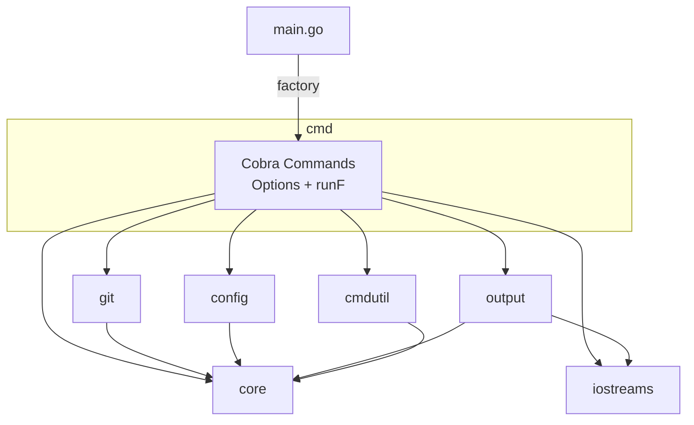
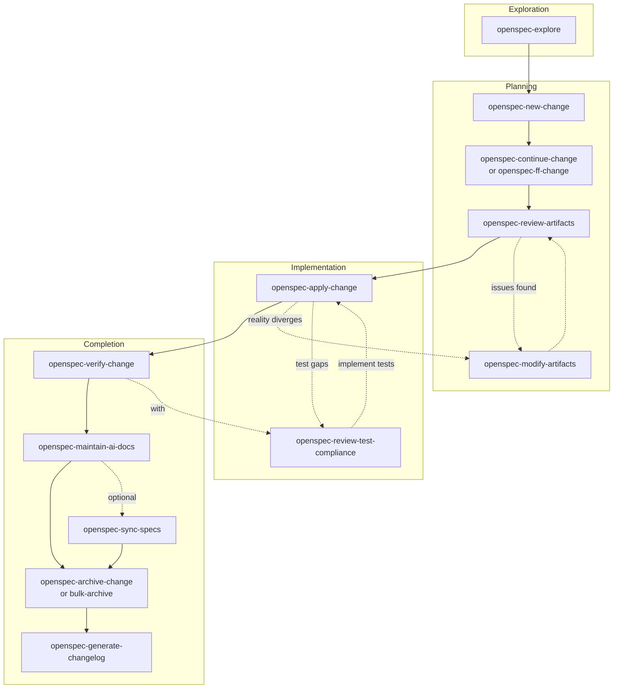

# Twiggit - OpenCode Reference

Pragmatic git worktree management tool with focus on rebase workflows.

## Architecture

Tier 2 layout (`golang-cli`): one functional core, one composition root,
and I/O adapters grouped by resource. The five-layer convention that pre-dates
`cli-functional-core-shell` is fully retired; the old `internal/{application,service,infrastructure,domain}/`
directories no longer exist.


```mermaid
graph TB
    main[main.go]
    subgraph cmd
        C[Cobra Commands<br/>Options + runF]
    end
    main -->|factory| C
    C --> core
    C --> cmdutil
    C --> output
    C --> iostreams
    C --> git
    C --> config
    git --> core
    config --> core
    output --> core
    output --> iostreams
    cmdutil --> core
    core
```

| Package | Role | Imports |
|---------|------|---------|
| `internal/core/` | Pure functional core: value objects, errors, validation, rules. No I/O. | stdlib, `github.com/samber/lo` |
| `internal/git/` | Git I/O adapter: client, reader, writer, hook runner, context resolver, shell probing. | stdlib, `lo`, `go-git`, `koanf`, `twiggit/internal/core` |
| `internal/config/` | koanf-backed config loader + XDG resolution. | stdlib, `koanf`, `twiggit/internal/core` |
| `internal/output/` | Formatter registry, error renderer, table writer, shell wrapper. | stdlib, `charm.land/lipgloss/v2`, `twiggit/internal/core`, `twiggit/internal/iostreams` |
| `internal/iostreams/` | TTY detection, IOStreams struct, lipgloss styles. | stdlib, `charm.land/lipgloss/v2`, `lo`, `golang.org/x/term` |
| `internal/cmdutil/` | `Factory` (functional-option construction; `WithVersion`/`WithConfigLoader`/`WithGitClientFactory`), `ExitCodeFor`, persistent flags, `HookRunner` consumer interface. | stdlib, `lo`, `twiggit/internal/core`, `twiggit/internal/iostreams` |
| `internal/version/` | Build-time version injection. | stdlib |
| `cmd/` | Cobra command tree (`list`, `create`, `delete`, `prune`, `cd`, `init`, `_carapace`, `version`). | everything above + `twiggit/cmd` |
| `main.go` | Composition root: Factory init, signal context, panic recover, cobra dispatch, exit-code mapping. | `twiggit/cmd`, `twiggit/internal/cmdutil`, `twiggit/internal/output` |

**Dependency rules are enforced by `.golangci.yml` depguard**; see
`openspec/changes/cli-functional-core-shell/design.md` for the rationale and
`openspec/changes/cli-functional-core-shell/proposal.md` §Lint for the rule
allow/deny lists.

## Toolchain Policy

Toolchain pins and linter/formatter posture are owned by `.mise/config.toml`,
`go.mod` (`tool` directive), and `.golangci.yml`. This section records the
**why** so future contributors do not re-litigate.

| Surface | Owner | Rule |
|---|---|---|
| Go toolchain | `go.mod` `go` directive + `.mise/config.toml` `go` | Bump together. Stay on the latest patch within the minor (currently `1.27.1`); security backports land in patches. |
| `golang.org/x/...` family | `go.mod` | Bump within `patch` scope on each release; reject major-version churn. `go.mod` is for code dependencies only — tool binaries (govulncheck, gocover-cobertura, etc.) live in `.mise/config.toml`. |
| `govulncheck` | `.mise/config.toml` `tools` | Pinned. Pre-commit and `mise run vuln:check` invoke the mise-installed binary. Never `@latest`. |
| `cosign` | `.mise/config.toml` `tools` | Pinned to match `goreleaser/goreleaser:v2.18.2` image bundle (`cosign v3.1.3`). CI `release` job signs SBOMs keyless via GitLab OIDC; local dev uses the mise-installed binary. Never `@latest`. |
| `syft` | `goreleaser/goreleaser:v2.18.2` image (bundled) | No CI-time install needed. The GitHub Actions release job runs inside the goreleaser Docker image as its job container (matching the GitLab CI pattern from `airk` and twiggit's own GitLab `release` job). The image bundles `goreleaser`, `syft`, `cosign`, and `gh`; `syft` tracks the image tag. |
| `gocover-cobertura` | `.mise/config.toml` `tools` | Pinned. `mise run ci:coverage` invokes the mise-installed binary for cobertura conversion. |
| `gocovmerge` | `.mise/config.toml` `tools` | Pinned. Available on PATH via `mise install` for downstream coverage merge workflows. |
| `golangci-lint` | `.mise/config.toml` + `.pre-commit-config.yaml` | Pinned to a single version; pre-commit reads from PATH so `mise install` provisions the matching binary. Update in one PR. |
| `gopls` | `.mise/config.toml` | Pinned to a single version. `mise run gopls:check` runs `gopls check ./...` across the module; `mise run gopls:stats` reports analysis state. |
| Linter set | `.golangci.yml` `linters.enable` | `nolintlint` MUST stay enabled so every `//nolint` directive is forced to carry a reason. New linters land in this change and the existing-rule tasks, not by the side. |
| Formatters | `.golangci.yml` `formatters.enable` | `gofumpt` (with `extra.group-params`) + `goimports`. Local rewrite via `golangci-lint fmt ./...`; `golangci-lint run` enforces but does not rewrite. |

Adding a new tool: `go get -tool <path>@<version>` for Go-managed tools,
`mise use <tool>@<version>` for mise backends, then update this table.

## CI Pipeline

`.gitlab-ci.yml` defines: `lint` (golangci-lint + govulncheck + go mod tidy gate), `test` (`go test -race ./...`), `build-ci-image` (TLS-enabled DinD), `goreleaser-dry-run` (path-filtered to `cmd/ internal/ .goreleaser.yml go.mod go.sum`), `release` (GitLab Releases API preflight → goreleaser → cosign SBOM sign), `mirror-to-github` (non-forced push).

| Job | Gate | Notes |
|-----|------|-------|
| `lint` | golangci-lint + `govulncheck ./...` + `go mod tidy && git diff --exit-code` | Single lint job; vuln scan + module-drift gate in one |
| `test` | `go test -race ./...` | Race detector folds into the main test job |
| `build-ci-image` | TLS DinD (`DOCKER_TLS_CERTDIR=/certs`, `DOCKER_HOST=tcp://docker:2376`) | Triggers on Dockerfile.ci, `.gitlab-ci.yml`, `.mise/config.toml`, `.goreleaser.yml`, go.mod/sum |
| `goreleaser-dry-run` | path-filtered to release-affecting paths | Docs-only MRs skip the dry-run |
| `release` | tag preflight via `/releases/v<tag>` API check, then `goreleaser release --clean`, then `cosign sign-blob --yes --output-signature <file>.sig` (OIDC keyless via GitLab OIDC, or `$COSIGN_KEY` fallback) | `interruptible: false`; `replace_existing_artifacts: false` |
| `mirror-to-github` | non-forced `git push` with `--tags` | Tag push routes through `when: never` |

Pipeline defaults: `retry: { max: 2, when: [runner_system_failure, stuck_or_timeout_failure] }`, `interruptible: true` (release job overrides to `false`).

## Essential Commands

| Command                | Purpose                                       |
| ---------------------- | --------------------------------------------- |
| mise run test          | All tests (unit/integration/e2e/race)         |
| mise run test:e2e      | CLI end-to-end tests                          |
| mise run test:golden   | Golden file tests (snapshot testing)          |
| mise run test:golden:update | Update golden files                      |
| mise run lint:check    | golangci-lint run (no rewrite)                |
| mise run lint:fix      | golangci-lint run --fix + formatters          |
| mise run format        | gofmt -w .                                    |
| mise run gopls:check   | gopls type/semantic diagnostics               |
| mise run gopls:stats   | gopls analysis state summary                  |
| mise run lint:gated    | gopls:check + lint:check                      |
| mise run vuln:check    | govulncheck dependency scan                   |
| mise run verify        | format + lint:fix + lint:gated + vuln:check + test + build |
| mise run build         | Build binary                                  |
| mise tasks             | List all tasks                                |

## Release

| Command                   | Purpose          |
| ------------------------- | ---------------- |
| mise run release:check    | Release prerequisites |
| mise run release:dry-run  | Test GoReleaser  |

**Distribution surface ownership** (split enforced at the goreleaser config layer):

| Surface | CI owner | Config | What it publishes |
| ------- | -------- | ------ | ----------------- |
| GitLab release | GitLab CI `release` job (`.gitlab-ci.yml`) | `.goreleaser.yml` (`force_token: gitlab`) | Tarballs, checksums, SBOMs to `gitlab.com/amoconst/twiggit/-/releases/v<tag>` |
| GitHub release | GitHub Actions `release.yml` | `.goreleaser.github.yml` (`force_token: github`) | Tarballs, checksums, SBOMs to `github.com/amauryconstant/twiggit/releases/tag/<tag>` |
| Homebrew cask | GitHub Actions `release.yml` | `.goreleaser.github.yml` `homebrew_casks:` block | `twiggit.rb` to `amoconst/homebrew-tap` `Casks/` directory |
| Tag mirror to GitHub | GitLab CI `mirror-to-github` job | `.gitlab-ci.yml` | `git push --tags --force-with-lease` (tag pipelines: `when: never`) |

**Invariant:** Goreleaser OSS cannot cross-SCM publish — the `token_type` field that would unlock it is Pro-only. The `homebrew_casks` branch existence pre-flight uses the inferred SCM's API (GitLab when `release.gitlab` is set, GitHub when `release.github` is set). Calling the wrong API on the wrong host returns 401 before the cask push. Therefore `homebrew_casks` MUST live in `.goreleaser.github.yml` only; putting it back into `.goreleaser.yml` re-introduces the v0.13.2 401. See `openspec/specs/infrastructure-release/spec.md` `Homebrew tap` requirement for the normative version.

**Invariant:** The GitHub Actions release job MUST run inside the `goreleaser/goreleaser:v2.18.2` Docker image (via the `container:` directive), not via `goreleaser-action@v6`. `goreleaser-action@v6` installs only the goreleaser binary; goreleaser's `sboms:` step then shells out to `syft` and fails with `exec: "syft": executable file not found in $PATH`. Using the Docker image as the job container bundles `goreleaser`, `syft`, `cosign`, and `gh` — symmetric with the GitLab CI `release` job and with `airk`.

**CHANGELOG**: Auto-generated via `openspec-generate-changelog` after archiving changes.

### SBOM verification

Each release publishes SPDX SBOMs (`*_sbom.spdx.json`) signed by `cosign`
keyless via OIDC (GitLab OIDC on the GitLab release, GitHub Actions OIDC
on the GitHub release; image-bundled `cosign v3.1.3`). Detached `.sig`
files are written to `dist/` locally for debugging but are NOT published
as release assets — verification uses the Rekor transparency log via
the keyless OIDC + identity flags:

```bash
# GitLab release SBOM (signed by GitLab CI release job)
cosign verify-blob \
  --certificate-identity 'https://gitlab.com/amoconst/twiggit//.gitlab-ci.yml@refs/tags/<TAG>' \
  --certificate-oidc-issuer 'https://gitlab.com' \
  twiggit_<VERSION>_linux_amd64_sbom.spdx.json

# GitHub release SBOM (signed by GitHub Actions release workflow)
cosign verify-blob \
  --certificate-identity 'https://github.com/amauryconstant/twiggit/.github/workflows/release.yml@refs/tags/<TAG>' \
  --certificate-oidc-issuer 'https://token.actions.githubusercontent.com' \
  twiggit_<VERSION>_linux_amd64_sbom.spdx.json
```

For OIDC-keyless verification cosign uses the ambient identity from the
TUF/Rekor transparency log; no public-key fingerprint is needed because
the signing cert is short-lived and rooted in Fulcio.

## Twiggit CLI Commands

| Command | Aliases | Purpose | Common Flags |
|---------|---------|---------|--------------|
| `list` | `ls` | List worktrees | `--all/-a`, `--output/-o` |
| `create` | - | Create new worktree | `--source`, `-C, --cd` |
| `delete` | `rm` | Delete worktree | `-f, --force`, `--merged-only` |
| `prune` | - | Delete merged worktrees | `-n, --dry-run`, `-y, --yes` |
| `cd` | - | Navigate to worktree | - |
| `init` | - | Shell integration setup | `-i, --install` |

## Pre-Commit Hooks

A clean checkout provisions the full toolchain via:

```bash
mise install      # provisions Go, golangci-lint, goreleaser, govulncheck, cosign, gopls, ginkgo, pre-commit, gocover-cobertura, gocovmerge
pre-commit install  # wires the git hooks (gofmt, govet, golangci-lint, whitespace, YAML/TOML validators, merge-conflict detection)
```

Run hooks manually: `pre-commit run --all-files`
Skip on a commit: `git commit -m "msg" --no-verify`

## Shell Integration

| Plugin | Location | Features |
|--------|----------|----------|
| Bash | `contrib/bash/` | Completions + navigation |
| Zsh | `contrib/zsh/` | Lazy-loaded completions + navigation |
| Fish | `contrib/fish/` | Completions + navigation |

**Quick setup:**
```bash
# Bash
eval "$(twiggit init bash)"
source <(twiggit _carapace bash)

# Zsh
eval "$(twiggit init zsh)"
source <(twiggit _carapace zsh)

# Fish
eval "$(twiggit init fish)"
twiggit _carapace fish | source
```

## Specification Keywords

| Keyword       | Meaning              | Usage                  |
| ------------- | -------------------- | ---------------------- |
| SHALL         | Mandatory            | Critical functionality |
| SHALL NOT     | Absolute prohibition | Security boundaries    |
| SHOULD        | Recommended          | Conventional patterns  |
| SHOULD NOT    | Discouraged          | Anti-patterns          |
| WILL/WILL NOT | System facts         | Behavior declarations  |
| MAY/MAY NOT   | Optional             | Extensibility points   |

## OpenSpec Foundation

**Invoke `openspec-concepts` skill when:**
- Starting your first OpenSpec task in this project
- Confused about workflow, artifacts, or state transitions
- Multiple active changes exist and you need guidance choosing
- User asks "how does OpenSpec work?"

**How:** Use the skill tool with name `openspec-concepts`

## OpenSpec Workflow

**Config**: `openspec/config.yaml` (spec-driven schema)

### When to Use

| Situation | Action |
| --------- | ------ |
| Multi-step change (3+ tasks) | Use OpenSpec |
| Refactor / architectural change | Use OpenSpec |
| Quick fix (1-2 lines) | Skip OpenSpec |
| Unclear requirements | `openspec-explore` first |

### Lifecycle


```mermaid
graph TB
    subgraph Exploration["Exploration"]
        E1[openspec-explore]
    end
    
    subgraph Planning["Planning"]
        P1[openspec-new-change]
        P2[openspec-continue-change<br/>or openspec-ff-change]
        P3[openspec-review-artifacts]
        P4[openspec-modify-artifacts]
    end
    
    subgraph Implementation["Implementation"]
        I1[openspec-apply-change]
        I2[openspec-review-test-compliance]
    end
    
    subgraph Completion["Completion"]
        C1[openspec-verify-change]
        C2[openspec-maintain-ai-docs]
        C3[openspec-sync-specs]
        C4[openspec-archive-change<br/>or bulk-archive]
        C5[openspec-generate-changelog]
    end
    
    E1 --> P1 --> P2 --> P3 --> I1 --> C1 --> C2 --> C4 --> C5
    C2 -.->|optional| C3 --> C4
    
    P3 -.->|issues found| P4
    P4 -.-> P3
    I1 -.->|reality diverges| P4
    I1 -.->|test gaps| I2
    I2 -.->|implement tests| I1
    C1 -.->|with| I2
```

### Skills by Phase

| Phase | Skill | Purpose |
| ----- | ----- | ------- |
| **Exploration** | `openspec-explore` | Think through ideas |
| **Planning** | `openspec-new-change` | Create change folder |
| | `openspec-continue-change` | Create one artifact |
| | `openspec-ff-change` | Create all artifacts at once |
| | `openspec-review-artifacts` | Review for quality |
| | `openspec-modify-artifacts` | Update artifacts *(also in Implementation)* |
| **Implementation** | `openspec-apply-change` | Implement tasks |
| | `openspec-review-test-compliance` | Check spec→test alignment *(also in Completion)* |
| **Completion** | `openspec-verify-change` | Validate implementation |
| | `openspec-maintain-ai-docs` | Update AGENTS.md |
| | `openspec-sync-specs` | Merge delta specs (optional) |
| | `openspec-archive-change` | Finalize single change |
| | `openspec-bulk-archive-change` | Archive multiple changes |
| | `openspec-generate-changelog` | Generate CHANGELOG.md |

### Project Conventions

| Rule | Detail |
| ---- | ------ |
| Tests | Written AFTER implementation (per config.yaml) |
| Progress | `openspec status --change <name> --json` |
| Artifacts | See `openspec/config.yaml` rules section |
| Spec categories | `cli-` / `core-` / `git-` / `testing-` (see below) |

## OpenSpec Spec Organization

Specs live under `openspec/specs/<category>-<name>/spec.md`. After `cli-functional-core-shell` lands, the prefixes map to source-tree layers as:

| Prefix | Layer | Owner |
| ------ | ----- | ----- |
| `cli-` | `cmd/` + `internal/cmdutil/` | Cobra command specs, Factory, IOStreams, exit codes, output, error formatting |
| `core-` | `internal/core/` | Value objects, errors, validation, path utilities, shell types |
| `git-` | `internal/git/` + `internal/config/` | Git client, resolver, hooks, shell-detect, config loading |
| `testing-` | `test/` | Test organization and patterns |

The legacy `application-`, `domain-`, `infrastructure-` prefixes persist in
`openspec/changes/*/specs/` only for changes that MODIFIED existing legacy
specs; the new-prefix ownership above is canonical for net-new specs. See
`openspec/config.yaml` for the full mapping and `openspec/changes/cli-functional-core-shell/proposal.md` §Non-goals for the deferred rename.

**Layout**: one folder per spec, single `spec.md` inside. Use `# Capability:` + `## Purpose` + `## Requirements` headers.

**Purity rules** (enforced by `openspec validate --specs`):

| Rule | Meaning |
| ---- | ------- |
| `[no-code-refs]` | No `path:N` or `pkg.Type` references inside spec prose; describe intent, not implementation |
| `[bare-cross-refs]` | Cross-references to other specs use bare names (`cli-create`), not folder paths |
| `[purpose-coherence]` | Each `### Requirement:` SHALL/MUST declare a single testable contract |

**Canonical ownership** for each prefix and the full rules live in `openspec/config.yaml`; consult it before adding or renaming specs.

**Dead code**: orphan fields, types, or behaviors that no spec claims are tracked in `openspec/dead-code.md`. Add an entry there when discovering unowned symbols; do not fold them silently into a related spec.

## Troubleshooting

| Issue | Solution |
| ----- | -------- |
| ValidationError wrapping | Return unwrapped, not via `fmt.Errorf` |
| `errors.As()` fails | Check error chain, ensure `Unwrap()` implemented |
| Context detection wrong | Check CWD, verify `.git` file in worktrees |
| Mock not matching calls | Verify `On()` args match actual call signature |
| Exit code 2 (usage) | Check command syntax, required arguments |
| `homebrew cask: GET https://gitlab.com/api/v4/.../homebrew-tap/...: 401 Unauthorized` in `goreleaser` output | `homebrew_casks` is in `.goreleaser.yml` (GitLab release config). Goreleaser OSS cannot cross-SCM publish — move the `homebrew_casks` block to `.goreleaser.github.yml` so the GitHub Actions release workflow owns it. |

Scripts and CI pipes historically keyed on exit codes 3-6 must update to
the 3-code contract (0/1/2): all non-usage failures exit 1; per-resource
NotFound distinction is preserved in the formatter's hint layer.

**Debugging:**
- Set `TWIGGIT_DEBUG=1` to see internal error details and stack traces
- Error messages include actionable hints for common issues
- Exit codes enable reliable scripting with specific error handling

## Location-Specific Guides

| File | Purpose |
| ---- | ------- |
| [CONTRIBUTING.md](CONTRIBUTING.md) | Development setup, testing, and contribution guide |
| [cmd/AGENTS.md](cmd/AGENTS.md) | CLI commands, Cobra patterns, command specs |
| [internal/version/AGENTS.md](internal/version/AGENTS.md) | Build-time version injection pattern |
| [test/AGENTS.md](test/AGENTS.md) | Test organization, quality requirements |
| [test/mocks/AGENTS.md](test/mocks/AGENTS.md) | Mock patterns, testify/mock usage |
| [test/integration/AGENTS.md](test/integration/AGENTS.md) | Testify suite patterns |
| [test/e2e/AGENTS.md](test/e2e/AGENTS.md) | Ginkgo/Gomega CLI testing |
| [test/e2e/README.md](test/e2e/README.md) | E2E debugging, cleanup patterns |
| [test/e2e/fixtures/AGENTS.md](test/e2e/fixtures/AGENTS.md) | E2E fixture usage |
| [test/concurrent/AGENTS.md](test/concurrent/AGENTS.md) | Concurrent test patterns |
| [test/helpers/AGENTS.md](test/helpers/AGENTS.md) | Test utilities |
