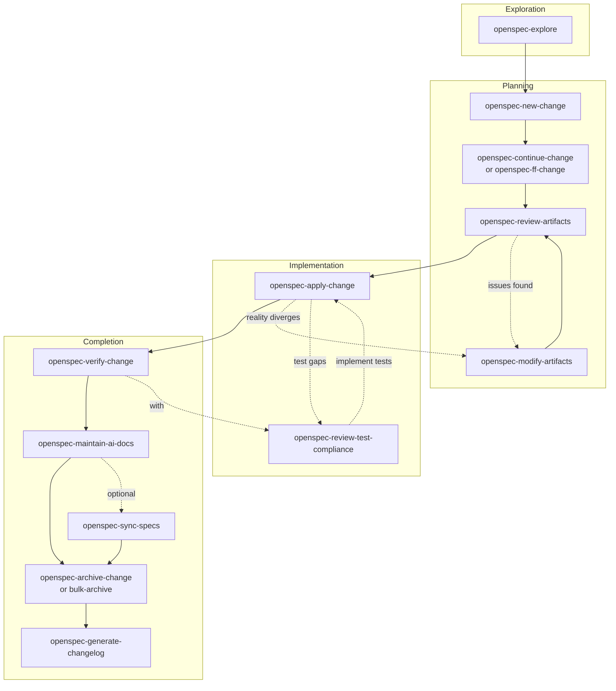

# OpenSpec Workflow Reference

OpenSpec drives every multi-step or refactor change in this repo. One-shot
fixes skip it; everything else routes through `openspec/changes/<name>/`.

**Config**: `openspec/config.yaml` (spec-driven schema)

## When to use the OpenSpec skill set

Invoke `openspec-concepts` when:
- Starting your first OpenSpec task in this project
- Confused about workflow, artifacts, or state transitions
- Multiple active changes exist and you need guidance choosing
- User asks "how does OpenSpec work?"

How: use the skill tool with name `openspec-concepts`.

## When to use OpenSpec itself

| Situation | Action |
| --------- | ------ |
| Multi-step change (3+ tasks) | Use OpenSpec |
| Refactor / architectural change | Use OpenSpec |
| Quick fix (1-2 lines) | Skip OpenSpec |
| Unclear requirements | `openspec-explore` first |

## Lifecycle

## Skills by Phase

| Phase | Skill | Purpose |
| ----- | ----- | ------- |
| **Exploration** | `openspec-explore` | Think through ideas |
| **Planning** | `openspec-new-change` | Create change folder |
| | `openspec-continue-change` | Create one artifact |
| | `openspec-ff-change` | Create all artifacts at once |
| | `openspec-review-artifacts` | Review for quality |
| | `openspec-modify-artifacts` | Update artifacts *(also in Implementation)* |
| **Implementation** | `openspec-apply-change` | Implement tasks |
| | `openspec-review-test-compliance` | Check spec→test alignment *(also in Completion)* |
| **Completion** | `openspec-verify-change` | Validate implementation |
| | `openspec-maintain-ai-docs` | Update AGENTS.md |
| | `openspec-sync-specs` | Merge delta specs (optional) |
| | `openspec-archive-change` | Finalize single change |
| | `openspec-bulk-archive-change` | Archive multiple changes |
| | `openspec-generate-changelog` | Generate CHANGELOG.md |

## Project Conventions

| Rule | Detail |
| ---- | ------ |
| Tests | Written AFTER implementation (per config.yaml) |
| Progress | `openspec status --change <name> --json` |
| Artifacts | See `openspec/config.yaml` rules section |
| Spec categories | `cli-` / `core-` / `git-` / `testing-` (see below) |

## Spec Organization

Specs live under `openspec/specs/<category>-<name>/spec.md`. After
`cli-functional-core-shell` lands, the prefixes map to source-tree layers
as:

| Prefix | Layer | Owner |
| ------ | ----- | ----- |
| `cli-` | `cmd/` + `internal/cmdutil/` | Cobra command specs, Factory, IOStreams, exit codes, output, error formatting |
| `core-` | `internal/core/` | Value objects, errors, validation, path utilities, shell types |
| `git-` | `internal/git/` + `internal/config/` | Git client, resolver, hooks, shell-detect, config loading |
| `testing-` | `test/` | Test organization and patterns |

The legacy `application-`, `domain-`, `infrastructure-` prefixes persist in
`openspec/changes/*/specs/` only for changes that MODIFIED existing legacy
specs; the new-prefix ownership above is canonical for net-new specs. See
`openspec/config.yaml` for the full mapping and
`openspec/changes/cli-functional-core-shell/proposal.md` §Non-goals for the
deferred rename.

**Layout**: one folder per spec, single `spec.md` inside. Use `# Capability:`
+ `## Purpose` + `## Requirements` headers.

**Purity rules** (enforced by `openspec validate --specs`):

| Rule | Meaning |
| ---- | ------- |
| `[no-code-refs]` | No `path:N` or `pkg.Type` references inside spec prose; describe intent, not implementation |
| `[bare-cross-refs]` | Cross-references to other specs use bare names (`cli-create`), not folder paths |
| `[purpose-coherence]` | Each `### Requirement:` SHALL/MUST declare a single testable contract |

**Canonical ownership** for each prefix and the full rules live in
`openspec/config.yaml`; consult it before adding or renaming specs.

**Dead code**: orphan fields, types, or behaviors that no spec claims are
tracked in `openspec/dead-code.md`. Add an entry there when discovering
unowned symbols; do not fold them silently into a related spec.
