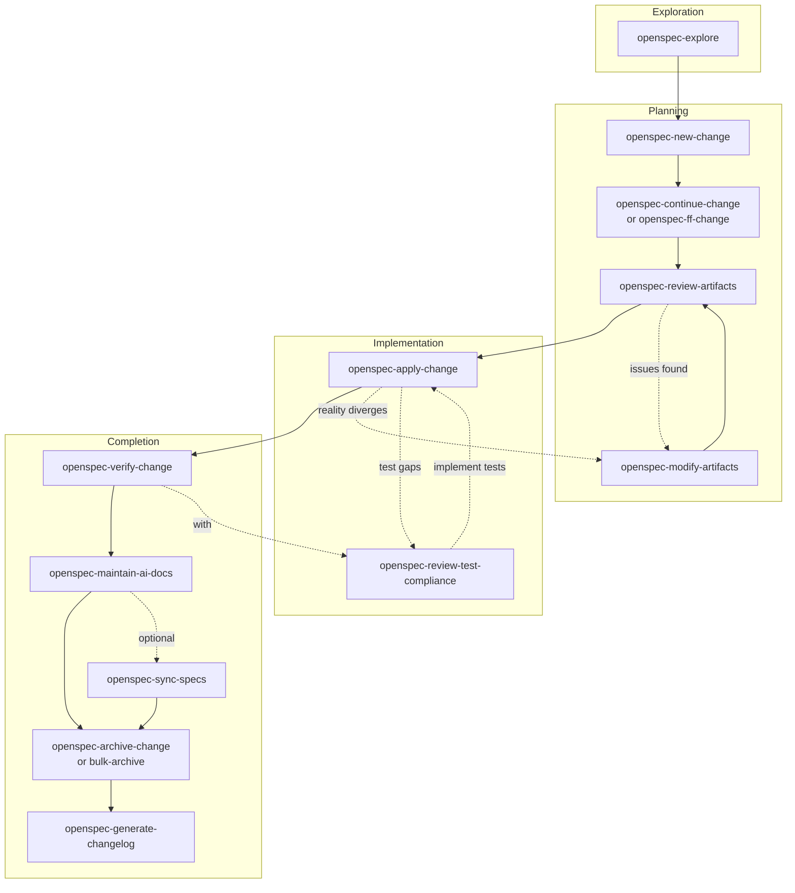

# OpenSpec Workflow Reference

OpenSpec drives every multi-step or refactor change in this repo. One-shot
fixes skip it; everything else routes through `openspec/changes/<name>/`.

**Config**: `openspec/config.yaml` (spec-driven schema)

## When to use the OpenSpec skill set

Invoke `openspec-concepts` when:
- Starting your first OpenSpec task in this project
- Confused about workflow, artifacts, or state transitions
- Multiple active changes exist and you need guidance choosing
- User asks "how does OpenSpec work?"

How: use the skill tool with name `openspec-concepts`.

## When to use OpenSpec itself

| Situation | Action |
| --------- | ------ |
| Multi-step change (3+ tasks) | Use OpenSpec |
| Refactor / architectural change | Use OpenSpec |
| Quick fix (1-2 lines) | Skip OpenSpec |
| Unclear requirements | `openspec-explore` first |

## Lifecycle

## Skills by Phase

| Phase | Skill | Purpose |
| ----- | ----- | ------- |
| **Exploration** | `openspec-explore` | Think through ideas |
| **Planning** | `openspec-new-change` | Create change folder |
| | `openspec-continue-change` | Create one artifact |
| | `openspec-ff-change` | Create all artifacts at once |
| | `openspec-review-artifacts` | Review for quality |
| | `openspec-modify-artifacts` | Update artifacts *(also in Implementation)* |
| **Implementation** | `openspec-apply-change` | Implement tasks |
| | `openspec-review-test-compliance` | Check spec→test alignment *(also in Completion)* |
| **Completion** | `openspec-verify-change` | Validate implementation |
| | `openspec-maintain-ai-docs` | Update AGENTS.md |
| | `openspec-sync-specs` | Merge delta specs (optional) |
| | `openspec-archive-change` | Finalize single change |
| | `openspec-bulk-archive-change` | Archive multiple changes |
| | `openspec-generate-changelog` | Generate CHANGELOG.md |

## Project Conventions

| Rule | Detail |
| ---- | ------ |
| Tests | Written AFTER implementation (per config.yaml) |
| Progress | `openspec status --change <name> --json` |
| Artifacts | See `openspec/config.yaml` rules section |
| Spec categories | `cli-` / `core-` / `git-` / `testing-` (see below) |

## Spec Organization

Specs live under `openspec/specs/<category>-<name>/spec.md`. The prefixes map
to source-tree layers as:

| Prefix | Layer | Owner |
| ------ | ----- | ----- |
| `cli-` | `cmd/` + `internal/cmdutil/` + `internal/iostreams/` | Cobra command specs, Factory, IOStreams, exit codes, output, error formatting |
| `core-` | `internal/core/` | Value objects, errors, validation, path utilities, shell types, hook types, role-interface segregation |
| `git-` | `internal/git/` + `internal/config/` | Git client, resolver, hooks, shell-detect, config loading, command executor |
| `testing-` | `test/` | Test organization and patterns |

**Layout**: one folder per spec, single `spec.md` inside. Use `# Capability:`
+ `## Purpose` + `## Requirements` headers.

### Active spec cross-references

Beyond the canonical ownership table above, these specs are
co-owned with adjacent layers; reference them by their bare
directory name when describing a cross-cutting concern:

- `core-worktree-status` (new in `add-status-command`) — owns
  `core.WorktreeStatus` extensions, the `WorktreeStatusReader`
  role, the per-worktree best-effort skip contract, and the
  `IsStale` derivation. Cross-referenced from `core-git` (the
  role-interface segregation requirement).
- `cli-status` (new in `add-status-command`) — owns the
  `twiggit status` command surface (flags, positional, four
  output shapes) and its exit-code contract.

### Recent cross-layer moves

- The `getWorktreeStatus` helper that used to live in
  `cmd/delete.go` was retired; the canonical per-worktree read
  path is now `core.WorktreeStatusReader.ReadWorktreeStatus`
  (`internal/git/status.go`). Both `cmd/status` and `cmd/delete`
  call the role; no copy remains in the `cmd/` layer.

**Purity rules** (enforced by `openspec validate --specs`):

| Rule | Meaning |
| ---- | ------- |
| `[no-code-refs]` | No `path:N` or `pkg.Type` references inside spec prose; describe intent, not implementation |
| `[bare-cross-refs]` | Cross-references to other specs use bare names (`cli-create`), not folder paths |
| `[purpose-coherence]` | Each `### Requirement:` SHALL/MUST declare a single testable contract |

**Canonical ownership** for each prefix and the full rules live in
`openspec/config.yaml`; consult it before adding or renaming specs.

## Code conventions enforced via golang-* skills

These bracketed keys codify the project-wide code conventions the AI agent
should follow during the **apply** phase. They are **not** part of the
OpenSpec `rules:` block (which is keyed by artifact ID; see
`openspec/project-config.js` for the schema). Enforcement lives in
`.golangci.yml` (mechanical) and human review (judgment); this section is
the AI agent's situational-awareness layer.

The `golang-how-to` orchestrator force-loads the relevant `golang-*` skill
per task intent (see `golang-how-to` SKILL.md "Load skill X when Y" table).
The keys below are the highest-value extractions from those skills,
restated as a flat reference. When a skill rule and a project preference
conflict, **project preference wins** (e.g., "NO comments in code unless
explicitly requested" from the root `AGENTS.md` overrides the
`golang-documentation` "every exported function MUST have a doc comment"
norm; the project norm for this repo is the comment-light variant).

### Error handling
- **[errors-checked]** Returned errors MUST always be checked; never discard with `_`. (golang-error-handling)
- **[errors-wrap-context]** Errors MUST be wrapped with `fmt.Errorf("{context}: %w", err)`. Exception: `core.ValidationError` and `core.UsageError` are returned unwrapped because their constructors already carry context. (golang-error-handling)
- **[errors-lowercase-no-punct]** Error strings MUST be lowercase, without trailing punctuation, and MUST NOT duplicate context that wrapping adds. (golang-error-handling, golang-naming)
- **[errors-is-as-only]** MUST use `errors.Is` for sentinel matching and `errors.AsType[T]` (Go 1.27+ generic API) for typed chain inspection; string-matching on `err.Error()` is prohibited. (golang-error-handling)
- **[single-handling-rule]** Errors MUST be either logged OR returned, never both. Adapter code in `internal/git/` returns wrapped errors only; logging happens at the cmd boundary via `opts.IO.Logger.With("command", cmd.Name()).Debug(..., "err", err)`. (golang-error-handling)
- **[no-panic-expected-failures]** NEVER use `panic` for expected error conditions; panic is reserved for programmer errors, impossible invariants, and `Must*` constructors. (golang-error-handling, golang-design-patterns)

### Lint discipline
- **[nolint-name-required]** `//nolint` directives MUST specify the linter name (e.g., `//nolint:errcheck`); bare `//nolint` is prohibited. (golang-lint)
- **[nolint-reason-required]** `//nolint` directives MUST include a justification comment immediately following the directive. (golang-lint)
- **[no-security-nolint]** Security linters (`gosec`, `bodyclose`, `sqlclosecheck`) MUST NOT be suppressed without a strong reason documented in the directive. (golang-lint)

### Cobra / CLI
- **[run-e-only]** Cobra commands MUST use `RunE`, never `Run`; `Run` cannot return errors. (golang-spf13-cobra)
- **[silent-usage-errors]** Root command MUST set `SilenceUsage: true` and `SilenceErrors: true` to avoid duplicate error printing. (golang-spf13-cobra, golang-cli)
- **[cmd-out-or-stdout]** Command handlers MUST use `cmd.OutOrStdout()` / `cmd.ErrOrStderr()` (or `opts.IO.Out` / `opts.IO.ErrOut`); direct `os.Stdout` / `os.Stderr` usage is prohibited. (golang-spf13-cobra, golang-cli)
- **[no-len-args-in-run-e]** Positional argument count MUST be validated via cobra `Args` validators (e.g., `cobra.ExactArgs(N)`); never inside `RunE`. (golang-spf13-cobra)

### Lifecycle / safety
- **[defer-close-immediate]** `defer Close()` MUST be placed immediately after a successful resource acquisition. (golang-design-patterns, golang-safety)
- **[timeout-every-call]** Every external call SHOULD have a timeout via `context.WithTimeout` or per-call deadline. (golang-design-patterns)
- **[safe-type-assertion]** Type assertions MUST use the comma-ok form `v, ok := x.(T)`; bare assertions panic on mismatch. (golang-safety)
- **[no-nil-map-write]** Maps MUST be initialized before write; writing to a nil map panics. (golang-safety, golang-code-style)
- **[defensive-copy-exports]** Exported functions returning slices or maps whose backing storage is shared with the caller MUST return defensive copies (`slices.Clone`, `maps.Clone`); incidental per-call returns SHOULD return defensive copies. (golang-safety)
- **[no-concurrent-map]** Maps MUST NOT be accessed concurrently without `sync.Map` or external synchronization. (golang-safety)
- **[no-init-functions]** `init()` MUST be avoided; use explicit constructors or `sync.OnceValue[T]` / `sync.OnceValues[T]` lazy initialization. (golang-design-patterns)

### Interfaces / composition
- **[interface-consumer-side]** Interfaces SHALL be defined where they are consumed, not where they are produced; concrete types return structs. (golang-structs-interfaces, golang-design-patterns)
- **[canonical-method-signatures]** Role interfaces (`RepositoryOpener`, `BranchReader`, `WorktreeStatusReader`, etc.) MUST have method sets enforced by a compile-time drift sentinel; signature changes ripple to all consumers. (golang-structs-interfaces, project-specific via `core-git`, `core-worktree-status`)

### Naming
- **[mixed-caps-only]** Identifiers MUST use `MixedCaps` or `mixedCaps`; underscores in identifiers are prohibited. (golang-naming)
- **[no-stuttering]** Names MUST NOT repeat information present in the package or surrounding context. (golang-naming)
- **[enum-unknown-zero]** Enum types MUST place an explicit `Unknown` or `Invalid` sentinel at `iota` position 0. (golang-naming, golang-design-patterns)
- **[err-prefix-suffix]** Error variables use `Err` prefix; error types use `Error` suffix; constructors use `New` or `NewTypeName`. (golang-naming)

### Testing
- **[require-for-preconditions]** `require` MUST be used for preconditions (setup, error checks); `assert` for verifications; mixing randomly is prohibited. (golang-stretchr-testify, golang-testing)
- **[assertion-expected-actual]** Testify argument order MUST be `(expected, actual)`; swapping produces confusing diff output. (golang-stretchr-testify)
- **[mock-assert-expectations]** Every mock-based test MUST end with `mock.AssertExpectations(t)` to verify expected interactions. (golang-stretchr-testify)
- **[test-observable-behavior]** Tests SHALL verify observable behavior, not internal implementation; refactor safety net requires this. (golang-testing)

### Dependencies
- **[go-sum-committed]** `go.sum` MUST be committed; it records cryptographic checksums of every dependency version. (golang-dependency-management)
- **[mod-tidy-pre-commit]** `go mod tidy` MUST be run before every commit that changes dependencies; CI MUST fail on module drift via `go mod tidy && git diff --exit-code`. (golang-dependency-management, golang-continuous-integration)
- **[stdlib-first]** Before proposing a new dependency, evaluate whether the standard library already covers the use case. (golang-dependency-management)
- **[ai-asks-before-add]** AI agents MUST ask the user for confirmation before running `go get` to add any new dependency. (golang-dependency-management)
- **[pin-binary-tools]** Executable tools MUST be pinned in `.mise/config.toml` (mise backends) or `go.mod` `tool` directives (Go 1.24+); `@latest` is prohibited for CI-affecting tools. (golang-dependency-management, project-specific)
