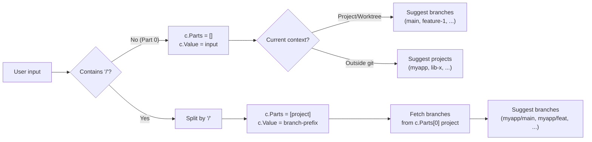
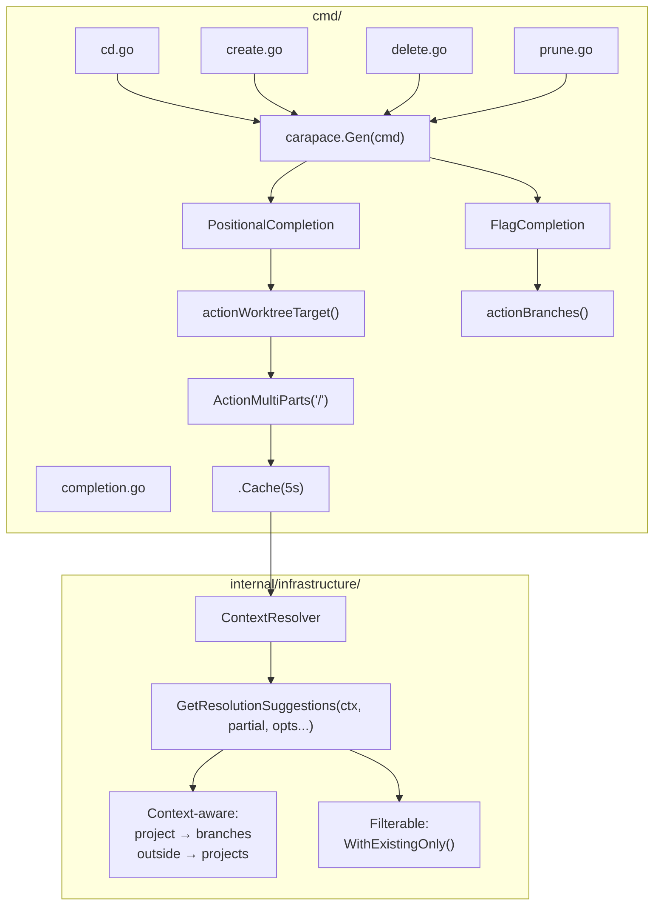

## Context

twiggit already has a suggestion system in `ContextResolver.GetResolutionSuggestions()` that provides context-aware completion candidates. However:

- No CLI integration exists - suggestions are generated but not exposed to shells
- Cross-project progressive completion (`project/` → branches) is not supported
- No filtering for existing worktrees only (needed for `delete` command)
- No shell completion scripts generated

**Carapace** is a shell completion generator that integrates with Cobra and provides:
- `ActionMultiParts` for progressive completion with delimiters
- Built-in caching and timeout support
- Support for 10+ shells (bash, zsh, fish, nushell, elvish, powershell, etc.)
- Rich styling and descriptions

## Goals / Non-Goals

**Goals:**
- Integrate Carapace for shell completion generation
- Wire `cd`, `create`, `delete`, `prune` commands to existing suggestion system via Carapace actions
- Add `--source` flag completion for `create` command
- Extend `GetResolutionSuggestions` with `SuggestionOption` for existing-worktree filtering
- Support progressive `project/branch` completion via `ActionMultiParts`
- Consolidate `internal/version/` into `cmd/version.go` to eliminate over-engineered package

**Non-Goals:**
- Caching completion results (Carapace provides `.Cache()` built-in)
- Modifying the shell wrapper installed by `init` command
- Auto-installing completions during `init`

## Decisions

### 1. Shell completion framework

**Choice:** Use Carapace instead of Cobra native completion

**Rationale:** Carapace provides:
- `ActionMultiParts("/")` - built-in progressive completion for `project/branch` syntax
- `.Cache()` - built-in caching with configurable TTL
- `.Timeout()` - timeout protection for slow git operations
- 10+ shells supported vs Cobra's 4
- ~100 lines of code savings (no manual completion command, simpler progressive logic)

**Alternatives considered:**
- Cobra native `ValidArgsFunction` - rejected: requires manual progressive completion logic, manual caching, fewer shells

**Integration:**
```go
// cmd/root.go
import "github.com/carapace-sh/carapace"

func NewRootCommand(config *CommandConfig) *cobra.Command {
    cmd := &cobra.Command{...}
    carapace.Gen(cmd)  // Adds hidden _carapace command
    // ...
}
```

### 2. Completion code location

**Choice:** `cmd/completion.go` with helpers that accept `*CommandConfig`

**Rationale:** Follows existing `cmd/util.go` pattern; completion is cmd-layer concern; thin adapter over existing `ContextResolver`

**Functions:**
```go
// cmd/completion.go
package cmd

func actionWorktreeTarget(config *CommandConfig, opts ...SuggestionOption) carapace.Action {
    return carapace.ActionMultiParts("/", func(c carapace.Context) carapace.Action {
        // Use config.Services.ContextService for suggestions
    }).Cache(5 * time.Second)
}

func actionBranches(config *CommandConfig) carapace.Action {
    // For --source flag completion
}
```

### 3. Progressive completion via ActionMultiParts

**Choice:** Use `ActionMultiParts("/")` for `project/branch` syntax

**Rationale:** Carapace handles delimiter splitting and context tracking automatically via `c.Parts` and `c.Value`

**Flow:**



**Implementation:**
```go
carapace.ActionMultiParts("/", func(c carapace.Context) carapace.Action {
    switch len(c.Parts) {
    case 0:
        // First part: projects or branches (context-aware)
        return actionProjectsOrBranches(c, config)
    case 1:
        // Second part: branches for selected project
        return actionBranchesForProject(c.Parts[0], config)
    default:
        return carapace.ActionValues()
    }
})
```

### 4. Service injection pattern

**Choice:** Pass `*CommandConfig` directly to action functions (closure pattern)

**Rationale:** Completions run in same process as CLI; `CommandConfig` contains all services; simpler than package-level variables

**Implementation:**
```go
// In cmd/cd.go
carapace.Gen(cmd).PositionalCompletion(
    actionWorktreeTarget(config),  // config captured via closure
)
```

### 5. Git operations in completion

**Choice:** Use existing internals (`ContextResolver`, `GoGitClient`)

**Rationale:** Consistency with rest of codebase; go-git is faster than spawning git CLI; existing error handling patterns

**Alternatives considered:**
- `ActionExecCommand("git", ...)` - rejected: adds CLI dependency, inconsistent with codebase

### 6. Version package consolidation

**Choice:** Merge `internal/version/version.go` into `cmd/version.go`

**Rationale:** 
- `internal/version/` is over-engineered for 3 variables used by single command
- Unexported variables (`version`, `commit`, `date`) sufficient - no external consumers
- Reduces package count, simplifies ldflags paths

**Changes:**
- Delete `internal/version/` directory
- Add unexported `version`, `commit`, `date` vars to `cmd/version.go`
- Update ldflags in `.mise/config.toml` and `.goreleaser.yml`:
  - `twiggit/internal/version.Version` → `twiggit/cmd.version`
  - `twiggit/internal/version.Commit` → `twiggit/cmd.commit`
  - `twiggit/internal/version.Date` → `twiggit/cmd.date`

### 7. SuggestionOption functional options

**Choice:** Extend `ContextResolver` with functional options pattern

**Rationale:** Single method signature supports multiple filters without proliferation

**Signature:**
```go
type SuggestionOption func(*suggestionConfig)

func WithExistingOnly() SuggestionOption {
    return func(c *suggestionConfig) { c.existingOnly = true }
}

func (cr *contextResolver) GetResolutionSuggestions(ctx *domain.Context, partial string, opts ...SuggestionOption) ([]*domain.ResolutionSuggestion, error)
```

### 8. Prune command completion

**Choice:** Reuse `actionWorktreeTarget(config, WithExistingOnly())` for prune command

**Rationale:** Prune command accepts same `[project/branch]` format as delete; both show existing worktrees only; DRY principle

**Wiring:**
```go
// cmd/prune.go
carapace.Gen(cmd).PositionalCompletion(
    actionWorktreeTarget(config, WithExistingOnly()),
)
```

### 9. Completion timeout configuration

**Choice:** Add `CompletionTimeout` to `domain.Config` with 500ms default

**Rationale:** 
- Allows users to adjust timeout for slow git operations without code changes
- 500ms default provides good balance between responsiveness and allowing git operations
- Timeout applies only to git operations (inside callbacks), not to cache lookups
- Graceful degradation: timeout returns empty suggestions, no error messages clutter shell

**Implementation:**
```go
// internal/domain/config.go
type Config struct {
    ProjectsDirectory    string
    WorktreesDirectory  string
    CompletionTimeout   time.Duration // Default: 500ms
}

// cmd/completion.go
func actionWorktreeTarget(config *CommandConfig, opts ...domain.SuggestionOption) carapace.Action {
    timeout := config.Config.CompletionTimeout
    if timeout == 0 {
        timeout = 500 * time.Millisecond // Default
    }
    
    return carapace.ActionMultiParts("/", func(c carapace.Context) carapace.Action {
        // Wrap git operations with timeout
        return carapace.ActionCallback(func(c carapace.Context) carapace.Action {
            // ... existing logic ...
            return suggestionsToCarapaceAction(suggestions)
        }).Timeout(timeout, carapace.ActionValues())
    }).Cache(5 * time.Second)
}
```

**Configuration via TOML:**
```toml
# ~/.config/twiggit/config.toml
[completion]
timeout = "500ms"  # Optional, defaults to 500ms
```

## Risks / Trade-offs

| Risk | Mitigation |
|------|------------|
| New Carapace dependency | Well-maintained library (3k+ GitHub stars); auto-bridges existing Cobra completions |
| Large repos with many branches could slow completion | Carapace `.Cache()` with 5s TTL; `.Timeout()` with 500ms default (configurable) |
| Cross-project completion requires git operations on other repos | Only triggered when `/` detected; user opt-in via typing |
| Version ldflags paths change | Update in both `.mise/config.toml` and `.goreleaser.yml` |
| Timeout too short for slow repos | Configurable via `[completion]timeout` in config.toml, 500ms default |

## Architecture



## Testing Strategy

| Layer | File | Scope |
|-------|------|-------|
| Unit | `internal/infrastructure/context_resolver_test.go` | Extended for `WithExistingOnly` option |
| Integration | `test/integration/context_detection_test.go` | Extended for real git operations |
| E2E | `test/e2e/completion_test.go` | New file using `_carapace` command |
| Config | `carapace.Test(t)` in `cmd/root_test.go` | Validates Carapace configuration and flag names |
